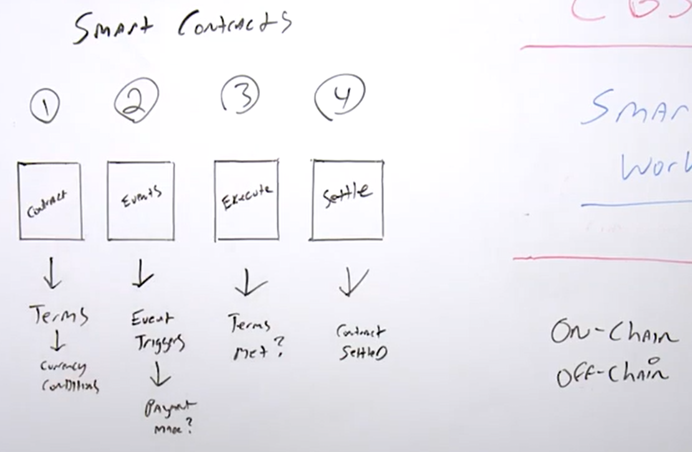
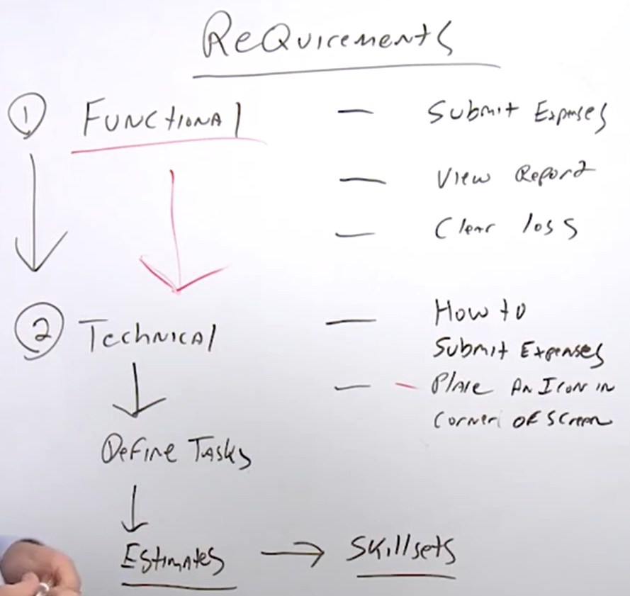
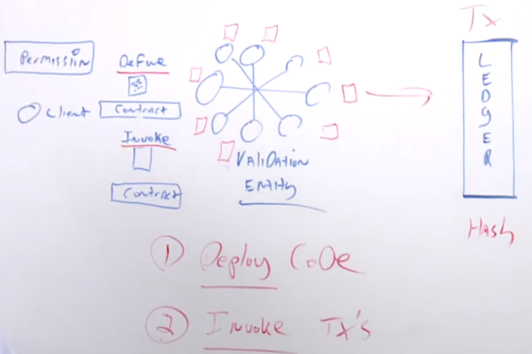

# M2 Basics of Blockchain

## L02: Blockchain and Cryptocurrency 

### 2.1 History of Blockchain

Blockchain History
- It is important to review the people who inhabit Yap Island and their unique currency called Rai Stones
- These stones could not be physically traded so the Yapese people used mental ledgers where all tribe members kept a copy of the ledger in their head
- First known use of a ledger

Byzantine Generals Problem
- The problem: Number of general (from same army) have surrounded a walled city on all sides
- Balance of power is such that if all generals attack at the same time, they will take the city
- The challenge: If general are not coordinated in their attack, they will lose the city and their campaign
- The solution: Use cryptography to encrypt messages
- Provides mathematical computation power
- Ensures privacy
- In 2008, a whitepaper is published by Satoshi Nakamoto which outlines a solution to the Byzantine Generals problem
- Bitcoin was started and thus the cryptocurrency launched in 2009

History
- Bitcoin uses a Proof-of-Work (PoW) consensus algo
- Work must be provided to solve the problem
- Bitcoin was the original solution to the BFT problem

Blockchain Release Date
- 2009: Bitcoin
- 2015: Ethereum
- 2015: Hyperledger

### 2.2 What is a Blockchain

Blockchain Basics
- Cryptographically secure, shared, distributed ledger
- Immutable transactions are written on this distributed ledger on distributed nodes
- Transformational technology in which business and government invest in
- It's a decentralised database which stores information in the form of transactions
- Blockchains are similar to a book that can be written to but not erased
   - Book = Blockchain
   - Page = Block
   - Page Entry = Blockchain Transaction
- Blockchains can be private or public
- Blockchains are a revolutionary way of implementing trust into a platform
- Blockchain is a globally shared data structure, transactional backend database (In Bitcoin, it's generally called a ledger)
   - Everyone can read entries in the database just by participating in the network
   - To change something in the database, you have to create a so-called transaction which has to be accepted by all other
   - Transaction implies that the change you want to make (assume you want to change two values at the same time) is either not done at all or completely applied
- Compare blockchain to other technology
   - Telcom network to a telephone
   - Databases are centralised where the blockchain is decentralised
   - Blockchains are not built from a new technology. They are built from a unique syncing of three existing technologies
		
Blockchain Technologies
- P2P networks
- Private Key Encryption
- Programs

Blockchain Digital Identity
- Digital Identity is established
   - Combining a public and private key creates a strong digital identity reference based on possession
	
Blockchain Revolution
- Blockchain is revolutionary in several ways
   - Blockchain is not a new technology but a synching of technologies that now make sense
   - Trust is at the center and essentially removes intermediaries (efficiency)
   - Tamperproof public ledger of value
   - Disruptive to the status quo. Legacy is out
   - Platform with numerous use cases

Blockchain Review
- Blockchain is a complex technology but is a simple concept really. Trust is at the center
   - Blockchains are ledgers shared among computers around the world
   - The ledgers in a blockchain are immutable

### 2.3 Blockchain Ledgers

Blockchain Ledgers
-  Consensus is when the distributed ledger has been updated and all nodes maintain their own identical copy of the ledger
-  This architecture allows for a new capacity as a system of recordkeeping that goes beyond being a simple database
-  A ledger is an append-only record store, where records are immutable and may hold more general information than financial records
-  A distributed ledger is a database that stored and updated independently by each node in the blockchain
  - Decentralised and distributed nature is what makes it unique
  - In blockchain, they are immutable
  - Every single node on the network processes every transaction that occurs

### 2.4 Blockchain Components

Blockchain Key Components
-  Cryptography
-  P2P Network
-  Shared Digital Ledger
-  Consensus Algorithm
-  Validity Rules
-  Virtual Machines

Cryptography
-  Cryptography for transactions
-  Recorded, encrypted and secured between peers in blockchain
-  No need for a centralised authority
	
P2P Network
-  P2P Network connects the blockchain nodes
-  All computers share responsibility on the network
-  Workloads are shared

Shared Digital Ledger
-  Shared Digital Ledger is a data structure managed inside the node application
-  Distributed Database held and updated independently by each participant (or node) in a large network

The Consensus Algorithm
-  The Consensus algorithm is implemented as part of the node application for how the ecosystem comes to a single view of the ledger
-  Different ecosystems have different methods for attaining consensus
-  Determines method for world state (view of the blockchain and its status)

Validity Rules
-  Validity Rules (validation) state how the user and the transactions will be validated

Virtual Machine
-  Virtual Machines are a representation of a server created by a computer program and operated with instructions embodied in a language
-  Ethereum and Bitcoin uses VMS
-  E.g., The virtual machine lives in the Ethereum node applications

### 2.5 Blockchain Permission (Private) or Permissionless (Public)

Blockchain Architectures
- Originally developed as permissionless (E.g., BTC)
- Public Blockchain, Open Blockchain, Permissionless
- Private Blockchain, Closed Blockchain, Permissioned, Enterprise Blockchain
- Ethereum is Permissionless, Hyperledger is Permissioned
- Enterprise prefer Private for security and performance

Considerations on private vs public blockchain
- Governance (Generally preferred private blockchain)
- Industry Vertical (Financial logistics -> Private BC, Social Media -> Public BC such as Ethereum)
- Smart Contract Functionality (Private BC such as Hyperledger has flexibility with smart contract unlike ripple. Public BC such as Ethereum is more suitable.
- Cryptocurrency Requirement
- Consensus Algorithm
- Costing Model (Private more expensive as supporting own nodes)
- Integration (BC to an enterprise application, Application Support, Developer integration)
- Transaction Performance
- Trust
- Transparency
- Privacy
- Security

### 2.6 Blockchain Considerations

| | Ethereum | Hyperledger |
| --- | --- | --- |
| Industry | Cross-Industry | Cross-Industry |
| Ledger | Permissionless | Permissioned |
| Consensus | POW | Pluggable Architecture |
| Smart Contracts | Yes | Yes |
| Coin/Token | Yes | No |

- Understand the industry that the blockchain is going to serve. 
  - Ethereum and Hyperledger are both considered to be cross-industry blockchains 
  - Ripple (more focused on financial industry) 
- Cross-industry 
  - Able to integrate it with your specific enterprise vertical 
    - Hyperledger can be used for EDI or logistics 
- Ledger 
  - Ethereum is for open blockchain approach 
  - Hyperledger is for enterprise 
- Consensus 
  - How it affects performance 
- Smart Contracts 
  - Does your blockchain support smart contract 
- Coin/Token 
  - Ethereum has native cryptocurrency such as Ether 
  - Hyperledger has no native cryptocurrency or token 

### 2.7 Trust or Trustless Blockchain 

Trust Blockchain 
- Establishing Trust In Blockchain 
  - Essentially transferring trust from an intermediary to technology  
  - Storing data in blockchain through cryptography functions 
  - All transaction data on the BC is assumed to be trustworthy 
  - Data has not been tampered with 
  - Blockchain is immutable (can't be deleted or modified) 

Trustless Blockchain 
- What is trustless in Blockchain 
  - Trustless as it is a model that does not require trust to safely interact and transact a deed or purchase 
  - Trustless blockchain is a transfer of trust to technology from organizations (Banks, Government, Corporations) 
  - Built on premise that "transparent code" essentially removes the need for intermediaries (technology) 
  - Smart contracts essentially reduce the need for accountants, lawyers, bankers etc as trust is formed. 
  - Financial transparency can result through the use of blockchains and thus reduce the need for intermediaries 
  - Ledger act as a trust broker when two parties don't trust each other 

### 2.8 Blockchain Forks and Segwits 

Forks 
- Fork is a change to the software of the digital currency that creates two separate versions of the blockchain with a shared history (One Dominant) 
- Can be permanent or temporary 
- Snapshot date where a snapshot of the ledger is captured 
- The snapshot happens at a block number and a new currency is a result (Bitcoin and Bitcoin Cash, Litecoin and Litecoin Cash) 

Hard Fork (Major Upgrade) 
- A hard fork describe a major change to the blockchain protocol which makes previously blocks invalid or transactions valid. 
- Can be used to keep the same coin with major changes to the blockchain or to create a new coin 
- Requires all nodes to upgrade to the latest version of the protocol software if they want to use the new coin or blockchain 

Soft Fork (Minor Upgrade) 
- A change that is backward compatible. Instead of 1MB blocks, new rule might only allow 500k blocks 
- A small feature or a capability that has essentially change 
- A change to the software protocol where only previously valid blocks/transactions are made invalid 
- Soft forks need a majority of hash power in the network 

Soft Fork vs Hard Fork
| Soft Fork | Hard Fork |
| --- | --- |
| Tightening the rules (E.g., 1MB -> 0.5MB) | Expanding the rules (E.g., 1MB -> 2MB) |
| Backwards compatible | Not backwards compatible |
| Old nodes accept new blocks | Old nodes don't accept new blocks |

Hard Fork Examples 
- Ethereum Classic is a split from an existing cryptocurrency Ethereum after a hard fork. 
- Monero is a hard-fork to introduce an upgrade to its network by implementing a feature called Ring Confidential Transactions (RCT) to improve its privacy and security 
- Bitcoin Cash is a hard fork orchestrated by a portion of the community that wanted Bitcoin to scale by increasing its block size from the current 1MB to 8MB 
 
Soft Fork Examples 
- BIP 66: Soft Fork on Bitcoin's signature validation 
- P2SH: Soft Fork that enabled multi-signature addresses in Bitcoin's network 
 
Segwit (Segregated Witness) 
- Separate transaction signatures 
- Removes signatures. 
- Create efficiency of transactions by removing signatures to free up capacity to add more transactions to the chain 
- Increases security threats by removing digital signatures 
- Improves scalability issue (UTX0) 
- Reduces transaction times by skipping calculation for signatures 
- Enables off-chain protocols (P2SH256) 
- Improve transaction security by reducing malleability (ability to be shaped) (transaction malleability) 
 

### 2.9 Comparing Crypto Currency vs Blockchain 

Cryptocurrency 
- Digital currencies are secured using cryptography and combining that with their role as a currency 
- Mined, not printed 
- Considered as digital gold, digital silver 
- E.g., Bitcoin, Litecoin, Monero, Dash, Ether, Ripple 
 
Initial Coin Offering 
- An event in which new cryptocurrency sells advance tokens from its overall coinbase in exchange for upfront capital 
- ICOs are frequently used to help developers raise capital

Differences between Cryptocurrency and Blockchain 
- Blockchain is the platform / Blockchain is the enabler 
- Cryptos like Bitcoin uses the blockchain platform / Cryptocurrency uses Blockchain Technology 
- Bitcoin is the first known software (token) for blockchain 
- Platform vs Application 
- BTC is a P2P cryptocurrency that uses the P2P platform (Blockchain) 
- Ethereum is a platform, Ether is the Cryptocurrency 
 
Analogy 
- Blockchain is the train track (Platforms are the enabler) 
- Cryptos are the trains on the track (Applications are enabled)

### 2.10 Bitcoin Improvement Proposal 

Bitcoin Improvement Proposal 
- BIP is a design document for introducing features or information to Bitcoin 
- BIP should provide a concise technical specification of the feature and a rationale for the feature 
- Standard way of communicating ideas since Bitcoin has no formal structure 
- Any developer or anyone from anywhere in the world can propose a BIP 
- Whole Bitcoin community of users, miners, developers and investors to vote on it 
 
Three Major Types of BIPs 
- Standard tracks 
- Informational 
- Process 

Standard Track BIPs 
- Entail making changes to the network protocol, block or transaction validation method 
- It intends to affect the interoperability of the two versions of BIPs or Bitcoin 
- Requires community consensus (E.g., BIP 91) 
 
Informational BIPs 
- Highlight design issues, general guidelines and supporting information 
- E.g., BIP 32 
 
Process BIPs 
- Describe or propose a change in the process 
- Similar to Standard Track BIP and require community consensus 
- E.g., BIP 2 

### 2.11 Cryptocurrency Wallet

Wallet 
- A program which allows you to gain access to send, and receive bitcoins on the blockchain 
- Several types of bitcoin wallets: Hardware, Software, Web 

Software Wallet 
- Programs that you download and run on personal computer 

Web Wallet 
- Hosted on website of a company which provides bitcoin wallet services 
- Wallets are easier to set up and use, but have to rely on hosting company to provide sufficient security measures, which can sometimes be a dangerous trade off  
- Coinbase is an online exchange that is hosted in US 

Hardware Wallet 
- Maintains high levels of security to protect your coins by storing your coins offline 
- Offline storage keeps your coins out of reach from hackers because they are not on the Internet 
- Cost is more expensive than a software or web wallet 
 
Paper Wallet 
- Offline wallet and is considered the safest type 
- Just a printout 
 
Wallet Security 
- Restrict unsupervised accessed. Strong passwords and close all ports and maintain a strict firewall 
- Frequently change address. Use a different address for every transaction 
- Multiple Signatures. Multiple private keys to deter breaches. 
 
Ethereum Wallets 
- E.g., Metamask, Myetherwallet, Jaxx (multi-cryptocurrency wallet) 

### 2.12 Value Creation 

Value Creation of Blockchain Technology 
- Costing 
- Security 
- Privacy 
- Efficiency (Remove Intermediaries) 
- Open source 
 
Value Creation of Blockchain Technology with Tokens 
- Tokens are used as a store of value as entries on a blockchain ledger 
- You own these tokens because you have a key that lets you create a new entry on the ledger, re-assigning the ownership to someone else 
- You don't store tokens on your computer; you store the keys that let you reassign the quantity 
- These are digital resources that you control and can reassign control to someone else 
 
Value Creation of Blockchain Technology with Smart Contracts 
- Smart Contracts is a computer program code that is capable of facilitating, executing, and enforcing the negotiation or performance of an agreement using Blockchain technology 
- Entire process is automated and it can act as a complement or substitute for legal contracts, where the terms of the smart contract are recorded in a computer language as a set of instructions 
- Are not legally enforceable 
- Provide autonomy, trust, backup (immutable), safety, speed, savings (no need for intermediaries), accuracy (removing human factor)

### 2.13 Ethereum Denominations 

| Unit | Wei | Wei |
| --- | --- | --- |
| Wei | 1wei | 1 | 
| Kwei | 1e3wei | 1,000 | 
| Mwei | 1e6wei | 1,000,000 | 
| Gwei (Shannon) | 1e9wei | 1,000,000,000 | 
| Microether | 1e12wei | 1,000,000,000,000 | 
| Milliether (Finney) | 1e15wei | 1,000,000,000,000,000 | 
| Ether | 1e18wei | 1,000,000,000,000,000,000 | 

Ether can be broken down into smaller units. 
Gwei is known as Shannon, MilliEther is known as Finney. 
EthDocs.org 

### 2.14 - 2.15 Etherscan & Etherstats (Demo) 

Etherscan.io 
- A blockchain explorer for ethereum. 
 
Network difficulty = how difficult is it for miners to be able to produce a block and get rewarded 
 
Ethstats.net 
- Tell number of active node 
- Gas price 
- Gas limit 
- Uncle Count 
- Transactions 
- Gas Spending 

### 2.16 Blockchain Decision Path 

Factors to decide which kind of blockchain to use (Permissioned or Permissionless) 
1) Database 
2) Multiple Organisation/People 
3) Trusted 
4) Uniform Rules 
5) Immutable 
6) Frequent TX 
7) Transparency 
8) Security 
9) Compliance 
 
- Ethereum is cheaper than Hyperledger 
- Ethereum is permissionless/public whereas Hyperledger is Permissioned/Privated.

## L03: Blockchain Consensus Algo

### 3.1 What is a Consensus Algo

Consensus is a dynamic way of reaching agreement in a group 
- In contrast, voting just settles for a majority rule without any thought for the feelings and well-being of the minority 
- Hence, consensus makes sure that an agreement is reached which could benefit the entire group as a whole. 
 
Example of BC Algos: 
- Proof of Work 
- Proof of Stake 
- Delegated Proof-of-Stake (DPoS) 
- Byzantine Fault Tolerance (BFT) 
- Directed Acyclic Graphs (DAGs) 

### 3.2 What Is Mining

Bitcoin Mining 
- In Bitcoin, mining is the process of adding transaction records to Bitcoin's public ledger 
- This ledger of past transactions is called the blockchain as it is a chain of blocks 
- The blockchain serves to confirm transactions to the rest of the network as completed 
- Bitcoin nodes use the blockchain to distinguish legitimate Bitcoin transactions from attempts to re-spend coins that have already been spent. 

Bitcoin mining is called so because it resembles the mining of other commodities. 
- Requires exertion and it slowly makes new currency available at a rate that resembles the rate at which commodities like gold are mined from the ground 
- Bitcoin uses the Hashcash proof of work algorithm 
- A reward is given when a block is discovered, the discoverer may award themselves a certain number of bitcoins, which is agreed-upon by everyone in the network 
- Currently this bounty is 25 bitcoins, but this value will halve every 210,000 blocks 
- The miner is awarded the fees paid by users sending transactions (Miners could receive the transaction fee which could be significant) 

- The fee is an incentive for the miner to include the transaction in their block 
 
Example of BC Algos: 
- Proof of Work 
- Proof of Stake 
- Delegated Proof-of-Stake (DPoS) 
- Byzantine Fault Tolerance (BFT) 
- Directed Acyclic Graphs (DAGs) 
 
Proof of Work 
- First blockchain consensus algorithm 
- Saotshi Nakamoto created for the BC blockchain 
- PoW miners solve hard problems to create blocks 
- PoW runs on a system of "the longest chain wins" 
- Expensive, both in terms of cost and environments 
- E.g., Bitcoin, Ethereum and Litecoin 
 
Proof of Stake 
- Blocks aren't created by miners doing work 
- Blocks are created by minters staking their tokens to "bet" on which blocks are valid  
- In the case of a fork, minters spend their tokens voting on which fork to support 
- Attacks costly but more environmental 
E.g., Peercoin, Dash, Ethereum (in the future) 
 
Delegated Proof-of-Stake 
- Miners can collaborate to make blocks instead of competing like in PoW and PoS 
- By partially centralizing the creation of blocks, DPoS can run orders much faster than most other algorithms 
- Cheaper transaction, faster and centralised 
- E.g., Steemit and EOS 
 
Byzantine Fault Tolerance 
- Classic problem is distributed computing and is explained with Byzantine generals 
- Pre-selected generals and meant for a private blockchain. 
- PBFT runs incredibly efficiently 
- High transaction throughput, but centralised/permission based 
- E.g., Hyperledger, Ripple and Stellar 
 
Directed Acyclic Graphs 
- DAGs are a form of consensus that doesn't use the blockchain data strcture and handles transactions mostly asynchronously. 
- The plus is theoretically infinite transactions per second (Don't have the nodes or the blockchain that slows down the transaction per second) 
- E.g., IOTA, Hashgraph

### 3.3 Proof-Of-Work (PoW)

Proof of Work 
- First blockchain consensus algorithm 
- Saotshi Nakamoto created for the BC blockchain 
- PoW miners solve hard problems to create blocks 
- PoW runs on a system of "the longest chain wins" 
- Expensive, both in terms of cost and environments 
- E.g., Bitcoin, Ethereum and Litecoin 
 
- Goal of proof of work is to solve the problem; a race. Whoever solves the problem first, gets the reward. 
- Ethereum still uses proof-of-work.  
- Depending on release of Ethereum, homestead version of Ethereum uses Ethash which is another PoW consensus algo. 

### 3.4 Proof-of-Stake (PoS)

Proof of Stake 
- Blocks aren't created by miners doing work 
- Blocks are created by minters staking their tokens to "bet" on which blocks are valid  
- In the case of a fork, minters spend their tokens voting on which fork to support 
- Attacks costly but more environmental 
E.g., Peercoin, Dash, Ethereum (in the future) 

### 3.5 Compare PoW and PoS

| | PoW (Mines) | PoS (Stakes) |
| --- | --- | --- |
| Blocks by mining | Yes | No |
| Speed | Slower TPS | Faster TPS |
| Rewards | Yes | Yes/No |
| Costing | Expensive | Cost Efficient |
| Example | BTC, Ether, LTC | Stratis, Pivix, Dash (Hybrid) |

- PoW is uses large amount of memory, TPUs, and Essex and specialised computer chips to process and mine cryptocurrencies. 
- PoS is not as intensive and generally have entities or organisations or even individuals putting up a monetary contribution in tokens to be able to participate in that blockchain as a minor. Proof of Stake is really a combination or could be hybrid or could be not really mining it all, it's more of a betting process. 
 
- Pivix is a hybrid of dash but dash uses the combination of PoW and PoS. 

### 3.6 Delegated Proof-of-Stake (DPoS) 

Delegated Proof-of-Stake (DPoS) 
- Miners can collaborate to make blocks instead of competing like in PoW and PoS 
- By partially centralizing the creation of blocks, DPoS can run orders much faster than most other algorithms 
- Cheaper transaction, faster and centralised 
- E.g., Steemit and EOS 
 
- Divides the consensus model in two fundamental parts 
  - Electing a group of block producers 
  - Scheduling production 
- Not everyone in a DPoS network can produce blocks to validate a transaction 
- Participants who hold token can cast votes to elect block producers 
- Voters are weighted by voter's stake. The block producer candidates that receive the most votes are those who produce blocks 
- In DPoS, you can think as stakeholders, notaries, block producers and witnesses 
 
Benefits 
- Separation of concerns where participants can be grouped appropriately, and mining and token control can be controlled better 
- Stakeholder (Token) control 
- Scalability to restrict the number of participants 
- On chain governance (Allow where to control where the network, nodes, participants are to comply to regulation) 
- Avoid "Nothing at stake" problem in which a small group of validators can take control of the network 
  - The fixed number of token validators in DPoS as well as the dynamic election model prevents this issues from happening 

### 3.7 Byzantine Fault Tolerance 

Byzantine Fault Tolerance 
- Classic problem is distributed computing and is explained with Byzantine generals 
- Pre-selected generals and meant for a private blockchain. 
- PBFT runs incredibly efficiently 
- High transaction throughput, but centralised/permission based 
- E.g., Hyperledger, Ripple and Stellar 
 
Byzantine General Problem state that no two node on a decentralised network can entirely and irrefutably guarantee that they are displaying the same data. 
- Satoshi Nakamoto solved the issue with BTC PoW Consensus Algo. 
- Essentially a "Byzantine" node is a node that can be rogue by not forwarding packets or perhaps mislead other nodes involved in the P2P Consensus network.  

### 3.8 Other Blockchain Consensus Algo

Proof of Elapsed Time (Proprietary Algorithm) 
- Created by Intel to run on their trusted execution environment  
- Similar to Proof-of-Work but more energy efficient 
- Major issue: Requires trust in Intel, places power back in the hands of a central authority 
- Good Solution in cases where we are able to trust an authority such as Intel. 
 
Proof of Authority 
- Uses a set of "authorities" - Nodes that are explicitly allowed to create new blocks and secure the blockchain 
- Replacement for PoW (Private blockchains only) 
- Earn the right to become a validator/authority 

Proof of Burn 
- Coins are "burned" by sending them to an address where they cannot be retrieved 
- The more coins you burn, the better your chances of being selected to mine the next block. 
- Eventually, you must stake more by burning more coins. 
 
Proof of Activity 
- Hybrid of PoW and PoS 
- Empty template blocks are mined (PoW), then filed with transactions which are validated via Proof-of-Stake 
- Similar to Dash. 
 
Proof of Capacity 
- Pay to play with hard drive space 
- The most space you 'stake', the better your odds of being selected to mine the next block. 
- Consensus algorithm generates large data sets called 'plots' which consume storage 
- Major criticism - Method has no deterrent for bad actors/rogue nodes

### 3.9 Hashing (Demo) 

Hashing 
- One way cryptographic function 
- Make sure it can't be decrypted 

Goal is that every time you write to a blockchain, the block will change and the hash will be different. 
- Block, Nonce, Data. 

## L04: Blockchain Use Cases

### 4.1 Business Use Cases and Models

A business model describes the rationale of how an organisation creates, delivers, and captures value in economic, social, cultural, or other contexts. 

E.g.,
- Business-to-Business (B2B) 
- Business-to-Consumer (B2C) 

- Consumer-to-Consumer (C2C) 
- Consumer-to-Business (C2B) 
- Business-to-Government (B2G) 
- Government-to-Business (G2B) 
- Government-to-Citizen (G2C) 

Blockchain Technology is already disrupting 
- Financial Services, Government Services, Healthcare, Real Estate and other industries on smaller scale 

Blockchain Technology is already evolving to where an organisation has to consider its effects to the business model in three main ways: 
- Technical 
- Business 
- Legal 

Use of Blockchain technology in several industries is affecting how services are delivered and how many people are involved in the delivery of that service 
- E.g., if you are a large financial organisation, and you do a lot of international transfers, it helps to rule out accountants, attorneys and intermediaries that are involved in the transfer. 
- Essentially a "disruption" in the business model is occurring. 

### 4.2 Blockchain Use Cases - G2C

- Dubai is not the only government investing in blockchain. 
- However they clearly are one of the more visible and [heavily invested](https://www.the-blockchain.com/2017/02/16/smart-dubai-office-sdo-1776-launch-blockchain-challenge/). 
- Dubai aims to be a pioneer in the adoption of emerging technologies such as Blockchain, which it recognizes has a major potential to transform city services 
- Dubai is investing in the Smart Dubai Office (SDO) and 1776 Launch Blockchain Challenge 

Dubai Blockchain strategy is based on three pillars 
- Government Efficiency 
  - Implementing Blockchain technology in government services 
- Industry Creation 
  - Supporting the creation of a Blockchain industry through empowering startups and businesses 
- Thought Leadership 
  - Leading the global thinking on Blockchain technology 

Dubai Blockchain strategy benefits 
- Dubai's adoption of blockchain technology at a city-wide scale is a testament to its commitment to positively transform government from service provider to service enabler 
- "We believe blockchain technology. With its built-in efficiency, accountability and security, blockchain holds a key to achieving our vision." 

### 4.3 Blockchain Use Cases - B2C

B2C Use Case 
- A Business-to-Consumer (B2C) is business or transactions conducted directly between a company and consumers who are the end-users of its products or services. 
- Services being provided to the consumer is an area of interest to the company 
-Consumers increasingly want more transparency in the services and products they purchases 
- Some area of focus 
  - Food Supply Traceability 
  - Resource Procurement 
  - Labor 
  - Logistics 
  - Compliance
- Verticals that are heavily exploring blockchain for transparency are 
  - Financials 
  - Logistics 
  - Charity Funding 
  - Agriculture Tracking 
  - Precious Metals 
  - Numerous other Verticals 

The jewelry industry has been known for fraud, child labor issues, false metal mining and a clear lack of transparency. 
- Precious metals consortium with IBM has established a blockchain initiative around how transparency can be brought to the consumer 
- The "TrustChain Initiative" tracks and authenticates diamonds and precious metals through every stage of the supply chain as it becomes a piece of finished jewelry. 
- The collaboration's goal is to instill trust in the origin and ethical sourcing of jewelry by bringing together a community of responsible and ethical organisations across the complex and multi-tiered jewelry supply chain. 
- Consumers will see that "TrustChain" establishes a trusted product with documented provenance and brings together quality assurance, social and environmental responsibility and authenticity spanning the entire jewelry ecosystem - From miners, manufacturers, wholesale suppliers and retailers - on a single digital platform. 

Benefits to the consumers from a blockchain solution is clear and established 
- Transparency to the consumers 
- Responsibility from the suppliers 
- Ethical Sourcing validation 
- Labor Verification 
- Immutable shared view

### 4.4 Common Use Cases for Cryptocurrency

- It is important to note whether to use permissioned or permissionless blockchains due to different use cases 
- Part of the use case may require a cryptocurrency or use of a token 
- Blockchain serve as the basis technology in which cryptocurrencies are a part of the ecosystem 
- They go hand-in-hand, and cryptocurrency is often necessary to transact on a permissionless blockchain 
  - Blockchains that are cryptocurrencies are the tokens used within these networks to send value and pay for these transactions 
  - They can be used to digitize value of an asset as well 
  - E.g., Bitcoin, Litecoin and Monero 

- Blockchains that are private for an enterprise don't generally need a cryptocurrency 
  - Private or Private Chain (Permissioned) 
  - E.g., Hyperledger, R3 Corda 

- A blockchain does not require cryptocurrency, but a cryptocurrency requires blockchain 
- The use case for cryptocurrency is more for permissionless blockchain instead of private/permissioned blockchain 

### 4.5 Database vs Blockchain Architecture

Legacy Architectures in Database 
- SQL or NoSQL 
- Whether centralised or distributed 
- Traditional databases use client-server network architectures 
- Database processing is quicker 
- Traditional databases use client-server network architecture 
- Control of the database remains with a designated authority (Require database administrator) 
- If security of the authority is compromised, then the data can be modified or even deleted 
- CRUD (Create, Read, Update, Delete). More flexible than blockchain. 

Database maintain 
- Disintermediation 
- Centralisation 
- Performance 
- Agility 
- Privacy 

Blockchain allows for two specific function: 
- Validation of a transaction 
- Writing of a new transaction 

Blockchain Properties: 
- Trustlessness 
  - Network participants help secure the network so there is no need for a centralised third party to be employed 
- Replication 
  - Blockchain stores a copy on every computer in the network 
- Immutable 
  - Once a piece of information is appended to the blockchain, it can never be edited 
- Timestamp 
  - A timestamp is a sequence of characters or encoded information identifying when a certain event occurs 
- Atomicity 
  - Either all of the operations in a transaction execute successfully and take the system to a different consistent state or nothing happens at all 
- Consistency
  - Integrity constraints must be maintained so that the database is consistent before and after the transaction 
- Isolation 
  - Multiple transactions can occur concurrently without leading to inconsistency of database state 
- Durability 
  - Once the transaction has completed execution, the updates and modifications to the database are written to disk 

### 4.6 Blockchain as a Service

Blockchain as a Service (BaaS) 
- Generally deployed on a Cloud Computing solution 
- Develop, test and deploy secure blockchain apps 
- Nodes are setup by provider 
- Proof-of-Concepts (POC) 
  - Use BaaS to enable a POC. For E.g, to deploy our own Ethereum and create custom deployment of it, we are able to test BaaS on Amazon or Azure to test if it fits requirements 
- No need for CAPEX or OPEX for management of infrastructure 

BaaS Providers 
- MS Azure 
- AWS 
- IBM 
- Stratis 
- HPE 
- Oracle 

- IBM supports Hyperledger very well. 
- Azure and AWS supports Ethereum differently. 

### 4.7 Cost Modelling 

One of the challenges when defining a blockchain, is the cost that is involved. 
Organisation uses two ways to fund projects. 

CAPEX
- Large expenditures that require signatures from executives, Board of Directors. 
- Goes through procurement in a lot of places 
- Takes longer time to process 

OPEX 
- Operational funds that are distributed to the organisation 
- Usually small amount of money to pay for subscriptions or training or day-to-day expenses 
- Does not need to go through CAPEX expenditures (getting approval from executives or BoD or procurement in lot of places) 

CAPEX is larger amount of money while OPEX is smaller amount of money. 

Areas of Cost Modelling 
- Procurement Process 
  - How are we going to go to provide a solution to the customer (CAPEX or OPEX?) 
    - Talk to point-of-contact, customer, client to better understand 
- Procurement Effectiveness 
  - How long will it take to occur 
  - OPEX can process procurements quickly 
  - CAPEX will process procurement much longer 
- Benchmarking 
  - How long is it going to take the solution from its infancy to deployment 
- Cost/Timelines 
- Pricing Strategy 
  - For blockchain

# M3 Ethereum Blockchain

## L05: Ethereum Blockchain Platform 

### 5.1 Ethereum Basics

History - The total supply of ether and its rate of issuance was decided by the donations gathered on the 2014 presale of the currency 
- 60 million ether created for the contributors of the presale 
- 12 million (20% of the above) were created for the development fund (early contributors and developers) and the remaining for the Ethereum Foundation 
- 5 ethers are created every block (about 15 seconds) for the miner of the block 
- 2-3 ethers may be sent to the uncle (rewards) 
- Most widely used Open Source Blockchain-based distributed computing application platform 
- Mainly used for building and implementing smart contracts functionality 
- It offers a Decentralised Virtual Machine aka Ethereum Virtual Machine (EVM) 
- Initiated by Vitalik Buterin in 2013 
- Ethereum's live Blockchain was launched on 30 July 2015 

Definitions 
- Ether is the native token of the Ethereum blockchain which is used to pay for transaction fees, miner rewards and other services on the network 
- Ethereum is an open software platform based on blockchain technology that enables developers to write smart contracts and build and deploy decentralised applications 

Ethereum has four main components 
- Nodes 
- Ethereum Virtual Machines 
- Smart Contracts 
- dApps 

Ethereum Virtual Machine (EVM) 
- Built into software running on the Ethereum protocol. It executes smart contracts (Ethereum programs written in the Solidity language) 
- The EVM is contained in the full nodes of the Ethereum network, inside of which it executes these Ethereum-user-written programs (smart contracts) 

EVM Code 
- EVM code is the programming language in which accounts on the Ethereum blockchain can contain code 
- The EVM code associated with an account is executed every time a message is sent to that account, and has the ability to read/write storage and itself send messages 

Gas 
- Measurement roughly equivalent to computational steps for Ethereum 
- Every transaction is required to include a gas limit and a fee that it is willing to pay per gas; miners have the choice of including the transaction and collecting the fee or not 
- Every operation has a gas expenditure on an EVM 

Ethereum 
- The Ethereum blockchain is a transaction-based state machine 
- In computer science, a state machine refers to something that will read a series of inputs and based on those inputs, will transition to a new state 
- Genesis State is the beginning state and then to the final state 
- For a transaction to be considered valid, it has to be processed by a validation process known as blockchain mining 
- Mining is when a group of nodes use their computing resources to create a block of valid transactions 

### 5.2 Ethereum Architecture

Ethereum Architecture 
- When designing or architecting your blockchain, there are some key areas to focus on 
- Private or Public dApps 
- Global Scaling 
- APIs 
- Smart Contract 
- User Interface 

The Ethereum protocol design process follows a number of principles. These principles are all involved in guiding Ethereum development, but they are not absolute 
- Sandwich Complexity Model 
  - Essentially like a three tier development best practice scenario to limit your complexity 
    - Top: User interface
    - Middle: Programming and Development
    - Bottom: Smart contract 
  - Avoid complexity by having the top and the bottom to be as simple, whereas the middle is to introduce your complexity. 
- Freedom 
  - Not limiting what you can do in Ethereum from a development standpoint 
  - If want to add additional capabilities or restrict, it's possible and up to us 
- Generalisation 
  - An approach where the development best practices is to make things as low layer as possible without restricting anything or making things too simplistic 
- We Have No Features 
  - Motto of Ethereum to make the platform as robust as possible 
    - Without worry about design features into it 
    - Modular 
- Non-risk-aversion 
  - Want to take risk instead of averting risk if it is totally not necessary 
- https://ethereumbuilders.gitbooks.io/guide/content/en/design_rationale.html 

Ethereum attends to the principals well by building what is essentially the ultimate abstract foundational layer 
- A blockchain with a built-in Turing complete programming language 
- Solidity is similar to Javascript 

Ethereum Architecture is built for both decentralisation and for distribution of content, processing etc. 

## L06: Ethereum Consensus

### 6.1 Blockchain Transactions

- Joe and Sally must have a wallet 
- Joe purchase Bitcoin and place in wallet 
- Joe initiate transfer of Bitcoin to Sally 
- Joe uses private key and signature and send its encrypted information over to the blockchain network which is a Bitcoin network. 
- Joe's private key will be synced up into blockchain to validate it's him, and that he possess the fund. Thus validating Joe that he possesses the right amount of Bitcoin to send to Sally 
- Assuming she has the right key, Sally will be able to receive the money into her wallet. 

Encryption --> Validation --> Distribution --> Written to Ledger (Immutable). 

### 6.2 Ethereum Architecture Overview

| Ethereum  Architecture |
| --- |
| Dapps |
| Smart Contracts |
| EVM |
| Nodes --> Ledger |
| Network |

- It has to be on a network (Internet). 
- Nodes are going to be deployed, where the ledger will be maintained 
- EVM will help to deploy the Smart Contract and Dapps 
- Smart Contracts are executable codes/computer program. 
- DApps is a collection of smart contracts 

### 6.3 Ethereum Ledger

Ethereum Ledger 
- Consensus is when the distributed ledger has been updated and all nodes maintain their own identical copy of the ledger 
- This architecture allows for a new capacity as a system of recordkeeping that goes beyond being a simple database 
- In Ethereum, the ledger is used for blockchain transactions 
- To access ledger, you need the keys 
- Ethereum uses public key cryptography for authentication 
  - Elliptic Curve Digital Signature Algorithm (ECDSA) secp256k1's curve is used 
- The private key is random 256 bit data sequence. 

## L07: Ethereum Value 

### 7.1 Ethereum Tokens 

When providing value, tokens is a good way to enable the platform to be able to provide value to users 

Ethereum Tokens 
- Ether is the native token of the Ethereum blockchain which is used to pay for transaction fees, miner rewards and other services on the network.  
- Using the Ethereum network requires you to pay for the privilege with gas 

Two Types of Tokens 
- Usage Tokens 
  - These are tokens in specific blockchain that are similar to their own native currency in their Dapps 
  - E.g., Golem or a gaming platform 

Work Tokens 
- These are the tokens that identify you as a sort of shareholder in the Dapps
- As a shareholder, you generally have some voting rights 
- E.g., Dash where you would possess tokens and have voting rights 

ERC20 defines a common list of protocols that an Ethereum token has to implement. 
- Allows developers to program behaviour of new tokens within the Ethereum ecosystem 
  - Common with crowdfunding companies via Initial Coin Offerings 

Coin Swap
- Change the current token to a new version token after an ICO 
- More on Ether Tokens: https://etherscan.io/tokens 

### 7.2 Ethereum Smart Contracts

The main value that Ethereum provides to organisations is the fact that you could write and implement smart contracts 

Smart Contracts 
- Describe computer program code that is capable of facilitating, executing and enforcing the negotiation or performance of an agreement using blockchain technology (Contract) 
- Entire process is automated and can act as a complement, or substitute for legal contracts 
- Terms of smart contract are recorded in a computer language as a set of instructions 
- Define the rules and penalties around an agreement in the same way that a traditional contract does 
- Automatically enforce those obligations 
- Several smart contracts can make up a DApps 

Smart Contracts provide: 
- Autonomy 
- Trust 
- Backup 
- Safety 
- Speed 
- Savings 
- Accuracy 

Type of Functions which are required in a smart contract 
- Constructor Function 
  - Function which is called only once when deploying smart contract 
    - E.g., used to receive the initial Ether sent to it at time of deployment 
- Fallback Function 
  - Function is essentially without a name and generally defined as a function in a code. 
    - E.g., (defined as function (){code…})  
  - Invoked when someone sends Ether to the address of your smart contract.  
  - If this function is not programmed, Ether sent to the smart contract will be rejected 

Smart Contracts 
- Provide security that is better than traditional contracts 
- Cut transactional costs associated with traditional contracting 
- Smart contracts on Ethereum network run on Ethereum Virtual Machine (EVM) [A Turing-based machine] 
- The Decentralised Applications (DApps) running on the Ethereum network are basically complex Smart Contracts 

Smart Contracts Enforcement 
- Basics of Ethereum states that all modifications to a contract's data must be performed by its code 
- Modification of a contract's data requires a blockchain user to send requests to its code. This process kickoff determines whether and how to fulfill those requests. 
- A traditional database uses an enforced stored procedure 
  - Think of this approach as predefined rules in blockchain

Smart Contracts Legal Enforcement 
- Smart Contracts may not be legally enforceable, especially across borders or jurisdictions 
- Could be used as evidence 
- Think of a vending machine where you put in the required funds to get the drinks or food 

### 7.3 Smart Contract Workflow

A smart contract is code that has been written to execute when conditions are met. 
- A contract has to have specific terms and currency conditions set. 
  - Has the money been sent? Is it the right amount? What about the timing? Or any other conditions. 
- As long as conditions are met, this mean that events will be triggered / events has been met. 
- Contracts will execute when all the terms are met. 
- Once the contract has executed, then the contract has been settled. 

The smart contract workflow can be done in several different ways to settle contracts 
- On-chain 
  - It is on the blockchain 
- Off-chain 
  - It could be sent to a payment gateway or another cryptocurrency gateway or blockchain.

## L08: Ethereum Platform

### 8.1 Ethereum DApps

Dapps (Decentralised Applications) 
- Applications that run on a P2P Network of computers, instead of a single computer 
- One or more smart contracts 
- Generally is open source 
- Data and records of operation of application to be cryptographically stored on ledger 
- Use cryptographic token 
- Generate tokens 
- Decentralised P2P Network 
- Access with Mist Browser 

### 8.2 Ethereum Gas Estimates

Estimate how much it cost to run the DApps with Gas 

Gas Price 
- Amount of Ether that you are willing to spend on every unit of gas 
- Need to determine the price of gas you want to pay for and the maximum amount of gas you want to spend on performing a transaction on the Ethereum network 
- The more important the processing of the transaction, the higher the price should be paid 

Use Metamask for confirming your transaction 
- Balance
- Gas limit 
- Gas Price 
- Can proceed to buy more Ether at Coinbase or Shapeshift 

Gas Price Units 
- Gwei = Unit of Ethereum coin used to calculate transaction Fee 
- One Ethereum coin is worth 1 billion Gwei 
- https://www.myetherwallet.com 

[ETH Gas Station](https://ethgasstation.info)
- Aims to increase the transparency of gas prices, transaction confirmation times, and miner policies on the Ethereum network 

### 8.3 Ethereum Virtual Machine

Ethereum Virtual Machine (EVM) 
- Computer software which runs at an abstraction layer straight above the underlying hardware (hypervisor) 
- Uses a Turing Complete Virtual Machine for running and compiling the codes 
  - Turing Complete states that this software is agile enough to run any code defined by the developer or user 
- EVM has limitation that a typical Turing Complete machine does not, which is that the EVM is intrinsically bound by gas 
- Power of EVM is limited by the amount of gas 
- Stack based VM (last-in-first-out stack) to hold temporary values 
- Implementation can be in Python, ruby, C++ and other languages 
- Fully isolated from network 

> In other words, the developers of Ethereum thought of a really creative way to limit some of the challenges that a token or cryptocurrency could induce. Essentially you can limit that VM by what you want to pay. Now, if you think about it, the price of Ethereum goes up and down every day. So let's say you decide to spend $10 at 6 p.m. and the price of Ethereum goes up 10%. Well, instead of that $10 you're spending, you would spend 11 by the time you execute. 
 
> So let's go ahead and sum this up. Let's make sure we get the terminology. With the EVM, it's going to use what's called gas. Now, gas is essentially going to be provisioned to the miners and that's essentially a way for you to pay an ether to be able to use the Ethereum network. Now, the developers of Ethereum were really creative with gas and basically they understood that the cryptocurrency, the token price could fluctuate, and it's a way for you as a developer to be able to propose a cost and stay within that cost. 

> According to them you can set fix limit. but the price of the gas is not fixed. So if gas is more than your limit, you wont be able to use the network. 

> Gas will change accordingly to the value based on the price of Ethereum so that the amount will always stay the same value of Ethereum at the end regardless of how much Ethereum changes 

### 8.4 Ethereum Networks

The Ethereum network has some terms to know around nodes and type of nodes 
- A node is a device (eventually runs EVM) , program, virtual machine that communicates with the Ethereum network 
- Node are also knowns as clients 
 
Ethereum Node Types 
- When joining the Ethereum network, you have some options of running various types of nodes 
  - Full node verify block that is broadcast onto the network 
    - Think of full node as a node that has the full blockchain 
  - Light node do not verify every block or transaction and do not have a copy of the current blockchain state 
    - A light node has a somewhat up-to-date but not the full blockchain downloaded 
  - Archive node are full nodes that preserve the entire history of transactions 
 
Ethereum Network 
- MainNet is data on the blockchain (which is the production Ethereum network) that includes account balances and transactions, which are public, and anyone can create a node and begin verifying transactions 
- Ether on this network has a market value and can be exchanged for other cryptocurrency or fiat currencies 
 
Three Main types of extended Ethereum Networks 
- Public Test Networks 
- Enterprise/Private Networks 
- Local Test Networks 
 
Public Test Networks (known as Testnets) 
- Public Test Network is used by developers to test Ethereum applications before final deployment to the main network (MainNet) 
- Ether on these networks is used for testing purposes only and has no value 
- E.g., Ropsten, Koven, Rinkeby 
  - [Ropsten](https://ropsten.etherscan.io): A proof-of-work blockchain that most closely resembles Ethereum; you can easily mine faux-Ether.  
  - Kovan: A proof-of-authority blockchain, started by the Parity team.  
  - Rinkeby: A proof-of-authority blockchain, started by the Geth team 
 
Private/Enterprise Test Networks 
- Private Ethereum networks allow parties or part of consortium, to share data without making it publicly accessible 
- Private blockchain is a good choice for sharing of sensitive data and scaling to handle higher read/write throughput 
- E.g., Quorum 
  - Developed by a consortium with [JP Morgan](https://www.jpmorgan.com/country/US/EN/Quorum)
 
[Ethereum Network Status Monitor](https://ethstats.net) 
- Check the health of the Ethereum network
- Must add your node to the network to be seen 
- Does not represent the full state of network 
- Shows Key Performance Indicators 
 
Local Test Network 
- Ethereum blockchain can be simulated locally for deployment 
- Local test networks process transactions instantly and Ether can be distributed as desired 
- Ethereum simulator 
- E.g., [Ganache](http://truffleframework.com/ganache) 

### 8.5 Ethereum Data Storage

Ethereum IPFS ([Inter-Planetary File System](https://ipfs.io))
- Peer-to-peer hypermedia protocol 
- Compare as a single BitTorrent swarm exchanging and sharing data through multiple computers storing the same file 
- IPFS is a versioned file system that can take files and manage them 
- IPFS will also store them somewhere and then tracks versions over time 
- IPFS accounts for how those files move across the blockchain network as in a distributed FS 
 
IPFS is a protocol 
- Defines a content-addressed file system 
- Coordinates content delivery 
- Combines Kademlia + BitTorrent + Git 
 
IPFS is a filesystem 
- With directories and files 
- Mountable filesystem (via FUSE) 
 
IPFS is a web 
- Can be used to view documents like the web 
- Files accessible via HTTP 
- Hash-addressed content guarantees authenticity 
- Browsers or extensions can learn to use the URL Scheme 
 
IPFS uses crypto 
- Cryptographic-hash content addressing 
- Block-level deduplication (remove redundancies in file structure) 
- File integrity + versioning 
- Filesystem-level encryption + signing support 
 
IPFS is P2P 
- Worldwide peer-to-peer file transfers 
- Completely decentralised architecture 
- No central point of failure (CPOF) 
 
IPFS is a CDN (Content-Delivery Network) 
- Add a file to the filesystem locally, and it's now available to the world 
- Caching-friendly 
- Bit-torrent-based bandwidth distribution 
  - Bit-Torrent is a distributed way to have media distributed where it's not centralised 
  - Bandwidth is optimised using a lot of bit-torrent's best practices and features 
 
IPFS has a name service, IPNS; An SFS inspired name system 
- Global namespace based on PKI 
- Serves to build trust chains 
- Compatible with other name service 
- Flexibility in namespace. 
  - E.g., can map DNS, .onion, .bit, etc. to IPNS. 

### 8.6 Gas Estimate (Demo) 

[EtherGasStation](https://ethergasstation.info)

Statistics 
- Standard cost of transfer 
- Gas Price Standard 
- SafeLow Cost for Transfer 
- Gas Price SafeLow 
  - Don't go below the price of it as your transaction may not process in a reasonable amount of time 
- Median Wait (Time) 
- Median Wait (Blocks) 
 
Graphs 
- Transaction Count by Gas Price 
- Confirmation Time by Gas Price 
- Recommended Gas Price 
- Top 10 Miners by Block Mined 

### 8.7 Gas Account Metamask (Demo)

[EthStats](https://ethstats.net)
 
Metamask can be used on the MainNet (main Ether network) or local test network or public test network. 
- Allow you to know your address 
- Estimate gas or pay for using the network 
- Buy tokens from Coinbase (Crypto/FIAT (USA only)) or ShapeShift (Crypto) 
  - Provide the exchange rate information 
  - Need to have your own BTC account to transfer 
 
- Able to view account on Etherscan 
- Able to download logs 
- Could set up URL as well 
- Able to change conversion to other cryptocurrencies or FIAT 

### 8.8 Blockchain Forks and Segwits 

EVM is a Turning Complete virtual machine which meant that it is agile enough to run any code 
 
EVM runs on top of the hardware, which is an abstraction layer.  
- It has the hardware, so it can be any node on any network 
- EVM is broken down into consensus (the blockchain, the algorithm, updating the blockchain), the Whisper (messaging service to interact with other nodes), Swarm (act as storage, which is IPFS storage). 
- EVM is limited by gas, which meant that for developers to use the EVM, they need to have enough gas to power it. 
  - If they want to execute any kind of transactions, they need to make sure that their balance of gas is enough to complete that smart contract or DApps.  
- Mist browser allow us to access the DApps.

## L09: Ethereum Development Tools

### 9.1 Ethereum Development Overview 

Tools with Ethereum 
- Languages 
  - Solidity, Serpent, Mutan 
- IDE 
  - Solidity Browser, Ethereum Studio 
- Clients 
  - Geth, eth, parity, Ethereum Wallet 
- Storage 
  - IPFS. Swarm and Storj 
- DApps Browser 
  - Metamask or Mist 
- Testing 
  - Testnet, TestRPC 
 
Frontend Tools used with Ethereum 
- HTML 
- CSS 
- JavaScript 
 
Backend Tools used with Ethereum 
- Solidity  
- Serpent 
 
Solidity 
- Language designed specifically for Ethereum, to utilise the EVM 
- Ethereum-based applications and Smart Contracts are written in Solidity 
- Solidity was proposed in August 2014 by Dr Gavin Wood for Ethereum 
- Uses a whole new framework that is similar to JavaScript and C 
 
Solidity vs JavaScript 
- Solidity is kind of an OOP language like C++ and C# whereas JavaScript is based on HTML 
- Solidity is designed specifically for Ethereum applications and it runs only on the Ethereum blockchain 
- JavaScript is a universal language for the web and is used in a large number of applications 
- APIs 
- JSON is a lightweight data-interchange format. It can represent numbers, strings, ordered sequences of values, and collections of name/value pairs. 
- To talk to an Ethereum node from inside a JavaScript application, use the web3.js library which gives an convenient interface for the remote procedure calls methods 

### 9.2 - 9.5 Ethereum Development Tool

[Metamask](https://metamask.io) is a bridge that allows you to visit the distributed web of tomorrow in your browser today 
- Browser for Ethereum 
- It allows you to run Ethereum dApps right in your browser without downloading/running a full Ethereum node 
- Metamask injects a JavaScript library called web3.js 
- MetaMask includes a secure identity vault, providing a user interface to manage your identities on different sites and sign blockchain transaction 
- Metamask could be considered as a zero client (no local storage) 
- Zero Clients run in the browser in JavaScript 
- Metamask is the best ERC20 compatible wallet, it provides extra layer of security from phishing sites 
- Download via browser extension in Chrome 
 
Mist 
- Browser for decentralised web apps (Web 3.0) 
  - IE or Google Chrome are for Web 2.0 
  - Still in heavy development and may not support untrusted dApps 
- It is a full node, and thus will download the full Ethereum blockchain 
- Integrates with Swarm 
- It is a flexible desktop hybrid electron application with a web interface 
- Developed by Ethereum foundation https://github.com/ethereum/mist 
 
Parity 
- Lightweight browser-based wallet that give users access to decentralised applications and currencies on Ethereum 
- Fastest and most efficient way to access the Ethereum blockchain 
- [Parity](https://www.parity.io) is an implementation is written in Rust 
- One of the two most common implementations in the Ethereum network 
- Parity comes with an extensive built-in Ethereum Wallet and dApp environment 
  - Allow you to develop and use the wallet at the same time 
  - It's fully integrated, no need to use a separate wallet and a separate development environment 
- It supports a Web3 dApp browser 
- Supported platform are Linux, Mav OS and Windows 
- Two types of installation: binary or scripted install for users 
  - Docker installation exist as well 
 
Geth (known as Go-Ethereum or GETH) 
- Implementation of Ethereum network written in the Golang/Go programming language 
- A multipurpose command line tool that runs a full Ethereum node implemented in Go 
- Can be downloaded and installed in a variety of ways 
  - Via Mist browser 
  - Package manager 
  - Docker containers 

### 9.6 Download Ethereum (Demo)

The wallet is essentially on the blockchain, and that when you are using the [Ethereum](https://www.ethereum.org) wallet, you are literally connected to the blockchain and that the wallet is located on the blockchain itself.  
 
So locally we are going to download the blockchain and the wallet will be set up. 
 
Things we can do 
- Send cryptocurrencies 
- Deploy new contracts 
- View other contracts on the blockchain 
- Create customise tokens 
- Watch other tokens that are on the Ethereum network 

### 9.7 Metamask (Demo)

[Metamask](https://metamask.io) is a great tool for folks that are using Ethereum 
- Especially Ethereum developers that don't want to download the full Ethereum block chain 
- Available in Chrome Extension or Brave Browser 
  - It is interesting because Chrome Extension is a webJ3 extension while Chrome is a web 2.0 browser. Thus this extension helps to interact with the Ethereum network and dApps as well 
  - Able to test and use other test network 
    - Ropsten, Kovan, Rinkeby 
    - Main Ethereum Network 
  - Able to view Etherscan (Block Explorer) 
  - Able to view QR code 
  - Copy address to clipboard 
  - Export Private Key 
- Metamask is a bridge to the Ethereum network.  
  - A web 3.0 browser 
  - It is a zero client. 

### 9.8 Technical Requirements

Functional requirements 
- General request by the user 
  - E.g., I want to be able to submit an expense or I want to view a report or I want to clear log files.  
- Functional requirements isn't very specific.  
  - Hence, technical requirements are the specific details that act as counterparts to functional requirements.  
- As a developer or solution architect, we have to look at functional requirement and ponder, how do we arrive from functional requirements to technical requirements? What do I need to do to execute this request?  
 
Technical requirements 
- Need to define tasks 
  - E.g., The technical requirement for how to submit expenses is I want to place an icon in the corner of my web screen or I want to place a link where the user can click to bring me to an application that will have me fill out a form.  
 
> So for the CBSA exam, what I want to make sure you understand is that the functional requirements drive the technical requirements and the technical requirements are actually what's going to define the tasks and the tasks then, once you define the tasks, you can get together your estimates of what you need, how much time it'll take to complete, any skill sets you may need, as well.  
 
> Your job as a Certified Blockchain Solutions Architect is to actually be able to define these requirements and then come up with the requirements and estimates, skill sets to successfully define a blockchain architecture. And for the exam, just remember the difference between functional and technical requirements. And that these are driven generally by the personas. 

### 9.9 Guiding Principles

Guiding Principles
- Guiding principles at a high level is about the agreement of your development team and the best practices on how to develop a blockchain solution 
- Agreement of team / Work together as a team 
  - Define what you're going to be working on 
  - How are you going to work on it 
  - What is the end game 
- Define persona 
  - A type of user and its user stories to help create functional requirements 
  - Functional requirements will help to define technical requirements 
 
Guiding principles act as a collection of best practices on how to go from start to finish when it comes to developing the blockchain architecture 

## L10: Ethereum Development Environment

# 10.1 Blockchain Testing 

Testing Ethereum Blockchain 
 
Ganache (formerly known as TestRPC) 
- Allows for testing and development with a local Blockchain simulation 
 
Truffle 
- A tool with a framework to release Blockchain application management system that allows for deployment and testing on Ethereum test and production Blockchains 
- Allow you to run multiple instances and see how it's going to run in your test environment and when you want to deploy it to MainNet 
 
Testing 
- When testing Ethereum apps, always follow the proper testing flow 
  - Local testing (e.g., laptop) > Test Network (e.g., Ropsten) > To Production (i.e., MainNet) 
- On Ethereum public Blockchain, make sure to use a tool such as Ganache (TestRPC) to test Smart Contracts locally before pushing to a test or production Blockchain 
- Agile Development 
  - Agile approach works well for pre-release but not for post-release / releasing to production 
    - Smart Contract is a permanent record on the Blockchain and cannot be removed once deployed 
    - Killing or calling a contract's self-destruct function (if implemented), will come with serious considerations. Hence, it is not recommended to continue an Agile cycle of continuous release and development once a contract is pushed to production 
      - We could kill the smart contract, but it is does not follow Agile best practices 

# 10.2 Truffle (Demo)

[Truffle](https://truffleframework.com)
- Package Management Framework that use Ethereum with 
- Developers often use it to integrates with Ganache 
- Goal of using a popular framework such as Truffle will help to create a pipeline and deploy software and test Smart Contracts in a fully integrated solution. 
- Install with NPM (Package Manager) 
- Truffle is development environment or development framework, that is used to create a pipeline to deploy Smart Contracts and test. This is commonly used with Ganache. 
 
https://ethereum.stackexchange.com/questions/58093/difference-between-ganache-and-truffle/58096 

# 10.3 Ganache (Demo)

Ganache 
- When we use Truffle, we tend to prefer to use it with Ganache 
- Able to deploy a local personal Ethereum blockchain that can run commands and test out the environment that we're deploying, testing and running. 
  - Quickly fire up a personal Ethereum blockchain which you can use to run tests, execute commands, inspect state while controlling how the chain operates - from Ganache website 
- It is a personal Ethereum blockchain that you would deploy to test an execute commands typically with Truffle. 

# 10.4 Remix

[Remix](http://remix.ethereum.org)
- Online Integrated Development Environment that focuses on the development and deployment of Solidity Smart Contracts 
- Able to develop and test smart contracts without downloading any software or invest in any development environments 
- Good Solution if you intent to 
  - Develop Smart Contracts 
    - As it has a fully integrated solidity editor 
  - Debug a Smart Contract's execution 
  - Access the state and properties of an already deployed Smart Contract 
  - Debug already committed transaction 
  - Analyse solidity code to reduce coding mistakes and to enforce best practices 

# 10.5 Remix (Demo) 

[Remix](http://remix.ethereum.org) is an online integrated development environment to play around with Solidity code 
- Points out any issue in execution 
- Able to select compiler version 
- Able to run analysis 
- Help to deploy, debug and develop Solidity-based contracts

# M4 Hyperledger Blockchain

## L11: Hyperledger Blockchain Platform and Project 

### 11.1 Hyperledger Basics Overview

Hyperledger is an open-source project that came out of the Linux Foundation and was created in to advance cross-industry blockchain technologies 
- Hyperledger is a popular blockchain solution among enterprises 
- A global open-source collaboration (e.g., IBM) involving leaders from numerous industries 
- Ethereum is set up by Ethereum foundation, but not as formal as how Hyperledger is set up. 
- Hosted by Linux Foundation which provides a governance structure and oversight to the Hyperledger community 
  - Uses a modular umbrella approach to enterprise blockchains 
    - Hyperledger is not one solution, it is a portfolio of different blockchain solutions that are integrated or more complementary to each other. 
 
Hyperledger Project consist of the following: 
- Infrastructure 
  - Ecosystems that accelerate open development and commercial adoption 
    - Linux Foundation has a marketing team and leadership team to promote Hyperledger as a whole 
- Framework 
  - A portfolio of differentiated approaches to business blockchain frameworks developed by a growing community of communities 
    - The consortium recognised that one blockchain solution does not make sense. 
    - Thus need a portfolio of different solutions to enable the right solution for the right business challenge 
- Tools 
  - Typically built for one framework, and through common license and community of communities approach, ported to other frameworks. 
    - Variety of tools has been built into the framework, in which these tools can be use through a common license and able to get support from the community 

### 11.2 Hyperledger Portfolio Overview 

Hyperledger Project has a modular schema to enable different facets of the Hyperledger Project and provide specific solutions for businesses 
- Infrastructure 
- Frameworks 
- Tools 
 
Infrastructure Module 
- Leadership 
- Governing Board 
- Marketing 
- Technical Steering Committee 
 
Framework Module 
- Hyperledger Indy 
  - Tools, library, and reusable components for providing digital identities rooted on blockchains or other distributed ledgers so that they are interoperable across administrative domains, applications, and any other silo 
    - Provides the capability to integrate with other solutions 
- Hyperledger Fabric 
  - Act as the foundation area for developing applications or blockchain solutions with a modular architecture 
  - Allows components such as consensus and membership services to be plug-and-play 
    - Able to add cryptocurrency capabilities as well with little bit of backend work 
- Hyperledger Iroha 
  - A business blockchain framework that is designed to be simple and easy to incorporate into infrastructural projects requiring distributed ledger technology 
    - A different approach but less complex than Fabric 
- Hyperledger Sawtooth 
  - A modular platform for building, deploying, and running distributed ledgers 
  - Includes a novel consensus algorithm, Proof of Elapsed Time (PoET), which targets large distributed validator populations with minimal resource consumption 
- Hyperledger Burrow (like a blockchain client) 
  - Permissionable smart contract machine 
    - First of its kind when released in 2014 
  - Provides a modular blockchain client with a permissioned smart contract interpreter built in part to the specification of EVM 
 
Tools Module 
- Hyperledger Quilt 
  - A development from NTT data, is a Java implementation of the inter-ledger protocol by Ripple, which is designed to transfer values across distributed and non-distributed ledgers 
    - Able to tie in other cryptocurrencies if needed or integrate Ripple with your blockchain 
- Hyperledger Cello 
  - Contributed by IBM 
  - Seeks to bring the on demand as-a-service deployment model into the blockchain ecosystem in order to reduce the effort required to create, manage, and terminate blockchains 
- Hyperledger Composer 
  - Contributed by IBM and Oxchains 
  - Set of collaboration tools for building blockchain business networks that accelerate the development of smart contracts and blockchain applications, as well as their deployment across a distributed ledger 
  - Go-to tool for Hyperledger when it comes to developing and deploying the blockchain solution 
- Hyperledger Explorer 
  - Originally contributed by IBM, Intel and DTCC (Depository Trust Corporation) 
  - It can view, invoke, deploy or query blocks, transactions and associated data, network information (name, status, list of nodes), chain codes and transaction families and other relevant information stored in the ledger 
    - Similar to Ethereum blockchain Explorer 
  - Goal is to see what is going on in the ledger 
- Hyperledger Caliper 
  - Blockchain benchmark tool that allows users to measure performance of a specific implementation with predefined use cases 
  - It's in Alpha mode at time of writing (2017) 
  - Contributed by developers of numerous organisation 

### 11.3 Hyperledger Fabric Reference Architecture

Hyperledger is an enterprise blockchain that contains services such as APIs, SDKs, CLIs. 
- Membership Service 
  - Permission to access as we do not want to let any node into our network 
- Blockchain Service 
- Transaction Service 
- Chain Code / Smart Contract Code 

Under services, you have security, general services and chain code. 
- Security 
  - Registration, Identity and Access Management, High Availability 
- General Service 
  - Consensus Algorithm, Ledger, P2P Communication Protocol, Storage (for ledger) 
- Chaincode 
  - Deployed in container, has container service, and container registry 
 
Lastly, it has event management and messaging services. 
 
At high level, this is the Hyperledger Fabric Architecture.

## L12: Hyperledger Project Structure

### 12.1 Hyperledger Infrastructure

Hyperledger Infrastructure Module 
- Leadership 
- Governing Board 
- Marketing 
- Technical Steering Committee 
 
Goal of the Linux Foundation's management of ecosystems that accelerate 
- Open development 
- Commercial Adoption 
 
Governing Board comprised of one voting representative from each Premier Hyperledger member and attended by the TSC and Marketing Committee Chairs, the Governing Board's responsibilities include 
- Approving a budget 
- Electing a Chair to preside over Governing Board meetings, authorize expenditures approved by the budget and manage any day-to-day operations 
- Oversee all Project business and marketing 

### 12.2 Hyperledger Fabric Model

Hyperledger Fabric is a permissioned enterprise blockchain, very modular with a lot of built-in capabilities with specific distinctions. 
- Two specific functions: Define and Invoke 
  - Users are able to deploy the code 
  - Invoke code by the transactions 
  - Able to deploy and invoke at the same time 
- Validation standpoint 
  - Entities are validators and could be the users as well 
  - Thus in Hyperledger, you can have validators and users

## L13: Hyperledger Value

### 13.1 Hyperledger Project Value

Hyperledger Project as a goal is a modular approach to how blockchains are developed, delivered, maintained and put into production. 
 
Hyperledger Project brings value to the enterprise in several ways 
- Open Source 
  - Able to take a software solution and provide it to the public domain and have it openly available to the public 
- Collaborative software development approach 
- Transparency to the user base 
- Longevity 
  - Maintain a solution and keep it relative 
- Interoperability 
  - Able to take other solutions and integrate them 
  - Able to take chain code and create side chain and add other values like adding crypto currencies and connections to Ripple and whichever solution it requires 
- Transformative 
  - Changing the way company do businesses 
- Goal is to bring blockchain technologies forward to mainstream commercial adoption fruition 

### 13.2 Hyperledger Composer

Hyperledger Composer is important to Hyperledger Fabric as Hyperledger Composer allows developers to build and deploy application on top of an abstraction layer for Hyperledger Fabric. 
 
Hyperledger Composer main benefits 
- Easy 
  - Not much learning curve if you are already developing in a specific language (e.g., Go or Java) that is well integrated. 
- Efficient 
  - Quick and easy as it is driven by workflows. 
- Risk Reduction 
  - A lot of built-in tools which alleviate a lot of the risks subjected to code 
- Flexible 
  - Able to vary based on how you want to use it 
 
- Hyperledger Fabric is going to be what you're going to deploy to Compose the applications to Fabric.  
- Application layer is going to be on top of Composer. 
- At a high level, Composer sits in the middle between Application and Fabric. 
- For Composer, inputs are sent to the ledger where the ledger is immutable. The outputs will got to a datastore and that's Hyperledger Composer at a high level.

## L14: Hyperledger Development

### 14.1 Hyperledger Design 

Hyperledger Fabric is a blockchain implementation that is designed for deploying a modular and extensible architecture. 
- It has a modular subsystem design so that different implementations can be plugged in and implemented over time. 
 
Modular and extensible 
- Modularity in all components of all frameworks 
  - Consensus layer 
  - Smart Contract layer 
  - Communication layer 
  - Data Store 
  - Identity Services (Root of Trust - to identify the participants) 
  - APIs 
  - And more components 
 
Interoperability 
- This principle is around backward interoperability and not focused on the interoperability between the various Hyperledger project-powered blockchain systems or business networks 
 
Secure Solutions 
- Enterprise and therefore business network security is paramount 
- The focus is on the interaction between components and the structure that governs the permissioning nature of permissioned blockchains 
 
Token or Cryptocurrency Agnostic 
- Hyperledger projects do not use crypto-assets, cryptocurrency, tokens, or coin-like constructs as incentive mechanics to establish trust systems. 
  - Can construct mechanisms to establish a trust between a system like Ripple or any other Cryptocurrency 
 
Rich APIs 
- The focus here is to ensure that blockchain systems have not only enterprise middleware access but instead access to business networks, existing participants and new systems without exposing the details of blockchain powered business networks. 
  - Not only do you have the enterprise middleware access, and the additional capabilities to extend your network and ecosystem 
 
Deploying Hyperledger Fabric 
- Hyperledger Fabric architecture can vary with each deployment due to its flexibility from modular architecture 
  - For a test and deploy environment, we might want to deploy two organisations, four perinodes and one certificate of authority and a solo auditor. 
- Production architecture should have a clustered CA and implement the correct number of orderer services 
- In a Hyperledger Fabric network, all the nodes should be clustered for availability, and all the block data and certification files should be backed up 
  - For best practices, whether it's Ethereum or Hyperledger, there are basics that we need to know such as availability, such as HA (High Availability), or fail over. 
    - Allow us to address any kind of issues in case an infrastructure go down in one area for other part to take over. 
- Production, test and development may want to be handled and design differently for each projects 
- Hyperledger Fabric is designed to be secure, but does not mean your deployment is automatically secure 
- Hyperledger Explorer can be used to interactively monitor the current Hyperledger Fabric network 

### 14.2 Hyperledger Fabric Design

Membership Services 
- This module is a permissioning module and act as a vehicle to establish a root of trust during network creation as this is instrumental in ensuring and managing the identity of members to determine who is going to access the blockchain 
 
Transactions 
- A transaction is a request to the blockchain to execute a function on the ledger 
- Function is implemented by a chaincode 
 
Smart Contract / Chaincode Services (Chaincode is an acronym for smart contract for Hyperledger) 
- Chaincode is an application-level code stored on the ledger as a part of a transaction 
- Chaincode runs transactions that may modify the world state 
- Transaction logic is written as chaincode (Go or JavaScript languages) and executes in secure Docker container 
- Chaincode is installed on peers, which require access to the asset states to perform reads and writes 

### 14.3 Hyperledger Playground 

Hyperledger Composer Playground 
- A tool which provides an environment that quickly model and test a blockchain network 
- [Composer](https://composer-playground.mybluemix.net/login) has a simple Graphical UI to edit and test the business blockchain network 
- Makes highly complex blockchain network easy for running blockchain testing 
- There is an online and offline version of Playground 
  - Online playground runs the business network in browser memory 
    - Convenient when you don't have the full downloaded blockchain or the full environment available 
  - Local playground is deployed in Hyperledger Fabric instances 
- Do you need the full Hyperledger Fabric instance or just enough to run in local memory 

### 14.4 Hyperledger Terminology

Block 
- An ordered set of transactions that is cryptographically linked to the preceding block(s) on a channel 
 
Chain 
- The ledger's chain is a transaction log structured as hash-linked blocks of transactions 
- Essentially sequence of the blockchain 
 
Chaincode (i.e., a Smart Contract in Ethereum) 
- A smart contract is code - invoked by a client application external to the blockchain network - that manages access and modifications to a set of key-value pairs in the World State 
 
Channel 
- Private blockchain overlay which allows for data isolation and confidentiality 
  - Instead of sending your transactions over the whole blockchain, we could set up a channel and delegate the transaction to only a specific node(s). 
- Channel-specific ledger that is shared across the peers in the channel, and transacting parties must be properly authenticated to a channel in order to interact with it 
 
Consensus 
- Broader term overarching the entire transactional flow, which serves to generate an agreement on the order and to confirm the correctness of the set of transactions constituting a block 
 
Endorsement 
- Process where specific peer nodes execute a chaincode transaction and return a proposal response to the client application 
  - Allow flexibility on executing chaincode 
 
Genesis Block 
- Configuration block that initialise the ordering service, or serve as the first block on a chain 
 
Gossip Protocol 
- The gossip data dissemination protocol performs three function 
  - Manages peer discovery and channel membership 
  - Disseminates ledger data across all peers on the channel 
  - Syncs ledger state across all peers on the channel 
 
State Database 
- Data is stored in a state database for efficient reads and queries from a chaincode 
  - Useful when want to increase performance or mitigate having to using the full blockchain  
- Supported databases include level DB and couchDB 
 
World State / Current state 
- A component of Hyperledger Fabric Ledger 
- Represents the latest values for all keys included in the chain transaction log 
- A specific snapshot at when the blockchain ledger is being looked at or reviewed 

# M5 Course Review and Wrapup

## L15: Course Wrapup

### 15.1 Let's Review Terminology

Blockchain 
- Type of distributed ledger, comprised of unchangeable, digitally recorded data in packages called blocks (rather like collating them on to a single sheet of paper) 
 
Block 
- A container data structure 
- In Bitcoin, a block contains more than 500 transactions on average 
- Contains digital signature, timestamp and relevant information 
- Block size is defined in megabits 
 
Cryptocurrency 
- Form of digital currency based on mathematics where encryption techniques are used to regulate the generation of units of currency and verify the transfer of funds 
 
dApp is a decentralised application that must be completely open-source, it must operate autonomously and with no entity controlling the majority of its tokens 
 
DAO (Decentralised Autonomous Organisation) 
- Think of it as a corporation run without any human involvement under the control of an incorruptible set of business rules 
 
Decryption 
- Process of turning cipher-text back into plaintext 
 
Encryption 
- Process of turning a clear-text message (plaintext) into a data stream (cipher-text) that looks like a meaningless and random sequence of bits 
 
Ether 
- Native token of Ethereum blockchain which is used to play for transaction fees, miner rewards, and other services on the network 
 
Ethereum 
- An open software platform based on blockchain technology that enables developers to write smart contracts, and build and deploy decentralised applications 
 
Ethereum Virtual Machine (EVM) 
- Built into the software running on the Ethereum protocol. It executes smart contracts. 
- Ethereum programs are written in the Solidity langauge 
 
EVM code 
- Programming language in which accounts on the Ethereum blockchain can contain code 
 
Gas 
- Measurement that is roughly equivalent to computational steps for Ethereum 
- Evert transaction is required to include a gas limit and a fee that it is willing to pay per gas 
- Miners have the choice of including the transaction and collecting the fee or not 
  - The higher your transaction fees, the quicker your transaction is going to happen 
- Every operation has a gas expenditure on an EVM 
 
Fork 
- Creation of an ongoing alternative version of the blockchain by simultaneously creating two blocks on different parts of the network 
- E.g., Bitcoin, Bitcoin Cash, Litecoin, Litecoin Cash 
- Creates two parallel blockchains where one of the two is the winning blockchain 
 
Ledger 
- An append-only record store, where records are immutable and may hold more general information than financial records 
 
Token 
- Digital identity for something that can be owned 
 
Tokenless Ledger 
- A distributed ledger that doesn't require a native cryptocurrency to operate 
 
Wallet 
- File that contains a collection of private keys 
 
Satoshi Nakamato 
- Name used by the unknown person or persons who designed bitcoin and created its original reference implementation 
 
satoshi 
- Smallest unit of the bitcoin currency recorded on the blockchain. 
  - One hundred millionth of a single bitcoin (0.00000001 BTC) 
 
Merkle Tree 
- A common Blockchain design, Merkle trees are used to create a lightweight digital fingerprint of all the transactions within a block 
- Provide an index of all the transactions on the blockchain 
 
Cryptography 
- Study of how to send information back and forth securely in the presence of adversaries 
  - The Secret 
    - The data which we are trying to protect 
  - The Key 
    - A piece of data used for encrypting and decrypting the secret 
  - The Function 
    - The process or function used to encrypt the secret 
  - The Cipher 
    - The encrypted secret data, output of the function 
 
Public Key Cryptography 
- Public Key 
  - Verify the digital signature of a given key pair 
- Private Key 
  - Sign/approve any transaction/action that might be made by the holder of the key pair 

### 15.4 Blockchain Roles

1) Developers 
2) Solutions Architect 
3) Sales Engineer 
4) Analyst 
5) Software Architects
