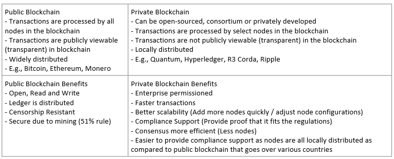
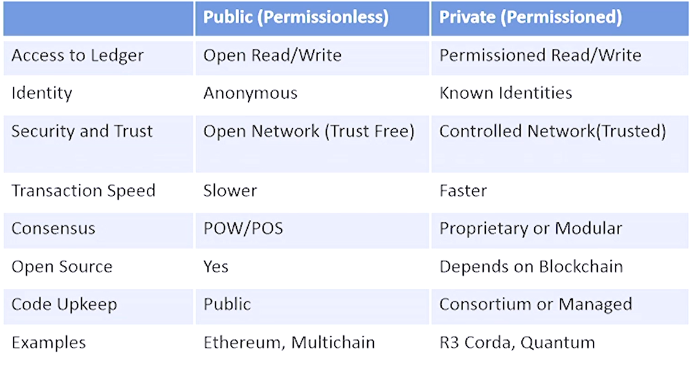
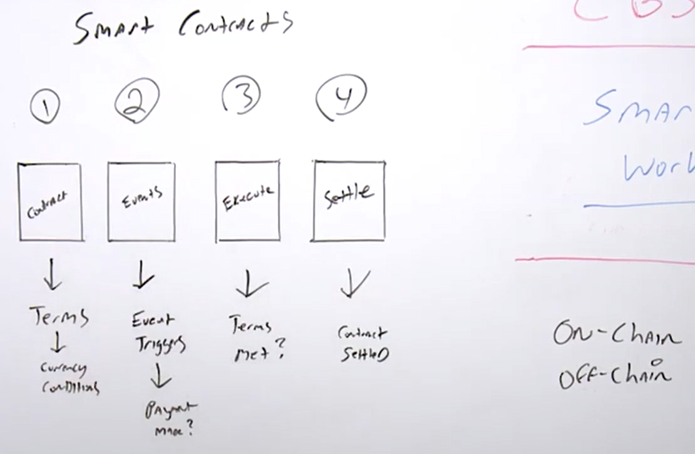
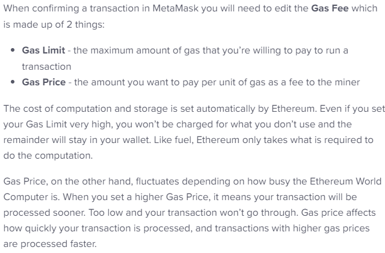
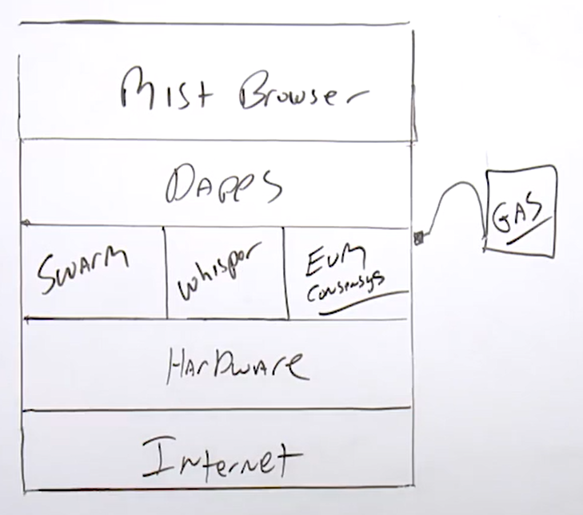

# 2.4 Blockchain Components

## Blockchain Key Component
- Cryptography
- P2P Network
- Shared Digital Ledger
- Consensus Algorithm
- Validity Rules
- Virtual Machines

# 2.5 Blockchain Permission (Private) or Permissionless (Public)
- open/permissionless and private/permissioned blockchain

# 2.6 Blockchain Considerations

| | Ethereum | Hyperledger |
| --- | --- | --- |
| Industry | Cross-Industry | Cross-Industry |
| Ledger | Permissionless | Permissioned |
| Consensus | POW | Pluggable Architecture |
| Smart Contracts | Yes | Yes |
| Coin/Token | Yes | No |

# 2.7 Trust or Trustless Blockchain 

Trust Blockchain 
- Establishing Trust In Blockchain 
  - Essentially transferring trust from an intermediary to technology  
  - Storing data in blockchain through cryptography functions 
  - All transaction data on the BC is assumed to be trustworthy 
  - Data has not been tampered with 
  - Blockchain is immutable (can't be deleted or modified) 

Trustless Blockchain 
- What is trustless in Blockchain 
  - Trustless as it is a model that does not require trust to safely interact and transact a deed or purchase 
  - Trustless blockchain is a transfer of trust to technology from organizations (Banks, Government, Corporations) 
  - Built on premise that "transparent code" essentially removes the need for intermediaries (technology) 
  - Smart contracts essentially reduce the need for accountants, lawyers, bankers etc as trust is formed. 
  - Financial transparency can result through the use of blockchains and thus reduce the need for intermediaries 
  - Ledger act as a trust broker when two parties don't trust each other 

# 2.8 Blockchain Forks and Segwits 

Soft Fork vs Hard Fork
| Soft Fork | Hard Fork |
| --- | --- |
| Tightening the rules (E.g., 1MB -> 0.5MB) | Expanding the rules (E.g., 1MB -> 2MB) |
| Backwards compatible | Not backwards compatible |
| Old nodes accept new blocks | Old nodes don't accept new blocks |

Segwit (Segregated Witness) 
- Separate transaction signatures 
- Removes signatures. 
- Create efficiency of transactions by removing signatures to free up capacity to add more transactions to the chain 
- Increases security threats by removing digital signatures 
- Improves scalability issue (UTX0) 
- Reduces transaction times by skipping calculation for signatures 
- Enables off-chain protocols (P2SH256) 
- Improve transaction security by reducing malleability (ability to be shaped) (transaction malleability) 
 
# 2.10 Bitcoin Improvement Proposal 
- BIP is a design document for introducing features or information to Bitcoin 

Three Major Types of BIPs 
- Standard tracks 
- Informational 
- Process

# 2.11 Cryptocurrency Wallet

Software Wallet 
- Programs that you download and run on personal computer 

Web Wallet 
- Hosted on website of a company which provides bitcoin wallet services 
- Wallets are easier to set up and use, but have to rely on hosting company to provide sufficient security measures, which can sometimes be a dangerous trade off  
- Coinbase is an online exchange that is hosted in US 

Hardware Wallet 
- Maintains high levels of security to protect your coins by storing your coins offline 
- Offline storage keeps your coins out of reach from hackers because they are not on the Internet 
- Cost is more expensive than a software or web wallet 
 
Paper Wallet 
- Offline wallet and is considered the safest type 
- Just a printout 
 
Wallet Security 
- Restrict unsupervised accessed. Strong passwords and close all ports and maintain a strict firewall 
- Frequently change address. Use a different address for every transaction 
- Multiple Signatures. Multiple private keys to deter breaches. 
 
Ethereum Wallets 
- E.g., Metamask, Myetherwallet, Jaxx (multi-cryptocurrency wallet)

# 3.1 What is a Consensus Algo

Example of BC Algos: 
- Proof of Work 
- Proof of Stake 
- Delegated Proof-of-Stake (DPoS) 
- Byzantine Fault Tolerance (BFT) 
- Directed Acyclic Graphs (DAGs)

# 3.2 What Is Mining

Proof of Work
- PoW miners solve hard problems to create blocks
- PoW runs on a system of "the longest chain wins"
- Expensive, both in terms of cost and environments
- E.g., Bitcoin, Ethereum and Litecoin

Proof of Stake
- Blocks are created by minters staking their tokens to "bet" on which blocks are valid
- In the case of a fork, minters spend their tokens voting on which fork to support
- Attacks costly but more environmental E.g., Peercoin, Dash, Ethereum (in the future)

Compare PoW and PoS
| | PoW (Mines) | PoS (Stakes) |
| --- | --- | --- |
| Blocks by mining | Yes | No |
| Speed | Slower TPS | Faster TPS |
| Rewards | Yes | Yes/No |
| Costing | Expensive | Cost Efficient |
| Example | BTC, Ether, LTC | Stratis, Pivix, Dash (Hybrid) |

Delegated Proof-of-Stake
- Miners can collaborate to make blocks instead of competing like in PoW and PoS
- By partially centralizing the creation of blocks, DPoS can run orders much faster than most other algorithms
- Cheaper transaction, faster and centralised
- E.g., Steemit and EOS
- Divides the consensus model in two fundamental parts 
  - Electing a group of block producers 
  - Scheduling production 
- Not everyone in a DPoS network can produce blocks to validate a transaction 
- Participants who hold token can cast votes to elect block producers 
- Voters are weighted by voter's stake. The block producer candidates that receive the most votes are those who produce blocks 
- In DPoS, you can think as stakeholders, notaries, block producers and witnesses

Benefits 
- Separation of concerns where participants can be grouped appropriately, and mining and token control can be controlled better 
- Stakeholder (Token) control 
- Scalability to restrict the number of participants 
- On chain governance (Allow where to control where the network, nodes, participants are to comply to regulation) 
- Avoid "Nothing at stake" problem in which a small group of validators can take control of the network 
  - The fixed number of token validators in DPoS as well as the dynamic election model prevents this issues from happening 

Byzantine Fault Tolerance
- Classic problem is distributed computing and is explained with Byzantine generals
- Pre-selected generals and meant for a private blockchain.
- PBFT runs incredibly efficiently
- High transaction throughput, but centralised/permission based
- E.g., Hyperledger, Ripple and Stellar

Byzantine General Problem state that no two node on a decentralised network can entirely and irrefutably guarantee that they are displaying the same data. 
- Satoshi Nakamoto solved the issue with BTC PoW Consensus Algo. 
- Essentially a "Byzantine" node is a node that can be rogue by not forwarding packets or perhaps mislead other nodes involved in the P2P Consensus network.  

Directed Acyclic Graphs
- DAGs are a form of consensus that doesn't use the blockchain data strcture and handles transactions mostly asynchronously.
- The plus is theoretically infinite transactions per second (Don't have the nodes or the blockchain that slows down the transaction per second)
- E.g., IOTA, Hashgraph

## 3.8 Other Blockchain Consensus Algo

Proof of Elapsed Time (Proprietary Algorithm) 
- Created by Intel to run on their trusted execution environment  
- Similar to Proof-of-Work but more energy efficient 
- Major issue: Requires trust in Intel, places power back in the hands of a central authority 
- Good Solution in cases where we are able to trust an authority such as Intel. 
 
Proof of Authority 
- Uses a set of "authorities" - Nodes that are explicitly allowed to create new blocks and secure the blockchain 
- Replacement for PoW (Private blockchains only) 
- Earn the right to become a validator/authority 

Proof of Burn 
- Coins are "burned" by sending them to an address where they cannot be retrieved 
- The more coins you burn, the better your chances of being selected to mine the next block. 
- Eventually, you must stake more by burning more coins. 
 
Proof of Activity 
- Hybrid of PoW and PoS 
- Empty template blocks are mined (PoW), then filed with transactions which are validated via Proof-of-Stake 
- Similar to Dash. 
 
Proof of Capacity 
- Pay to play with hard drive space 
- The most space you 'stake', the better your odds of being selected to mine the next block. 
- Consensus algorithm generates large data sets called 'plots' which consume storage 
- Major criticism - Method has no deterrent for bad actors/rogue nodes

Blockchain Properties: 
- Trustlessness 
  - Network participants help secure the network so there is no need for a centralised third party to be employed 
- Replication 
  - Blockchain stores a copy on every computer in the network 
- Immutable 
  - Once a piece of information is appended to the blockchain, it can never be edited 
- Timestamp 
  - A timestamp is a sequence of characters or encoded information identifying when a certain event occurs 
- Atomicity 
  - Either all of the operations in a transaction execute successfully and take the system to a different consistent state or nothing happens at all 
- Consistency
  - Integrity constraints must be maintained so that the database is consistent before and after the transaction 
- Isolation 
  - Multiple transactions can occur concurrently without leading to inconsistency of database state 
- Durability 
  - Once the transaction has completed execution, the updates and modifications to the database are written to disk
 
# 5.1 Ethereum Basics
Ethereum has four main components
- Nodes
- Ethereum Virtual Machines
- Smart Contracts
- dApps

Ethereum Virtual Machine (EVM) 
- Built into software running on the Ethereum protocol. It executes smart contracts (Ethereum programs written in the Solidity language) 
- The EVM is contained in the full nodes of the Ethereum network, inside of which it executes these Ethereum-user-written programs (smart contracts) 

EVM Code 
- EVM code is the programming language in which accounts on the Ethereum blockchain can contain code 
- The EVM code associated with an account is executed every time a message is sent to that account, and has the ability to read/write storage and itself send messages 

Gas 
- Measurement roughly equivalent to computational steps for Ethereum 
- Every transaction is required to include a gas limit and a fee that it is willing to pay per gas; miners have the choice of including the transaction and collecting the fee or not 
- Every operation has a gas expenditure on an EVM 

Ethereum 
- The Ethereum blockchain is a transaction-based state machine 
- In computer science, a state machine refers to something that will read a series of inputs and based on those inputs, will transition to a new state 
- Genesis State is the beginning state and then to the final state 
- For a transaction to be considered valid, it has to be processed by a validation process known as blockchain mining 
- Mining is when a group of nodes use their computing resources to create a block of valid transactions 

# 5.2 Ethereum Architecture
- Sandwich Complexity Model 
  - Essentially like a three tier development best practice scenario to limit your complexity 
    - Top: User interface
    - Middle: Programming and Development
    - Bottom: Smart contract 
  - Avoid complexity by having the top and the bottom to be as simple, whereas the middle is to introduce your complexity.
 
# 6.1 Blockchain Transactions

- Joe and Sally must have a wallet 
- Joe purchase Bitcoin and place in wallet 
- Joe initiate transfer of Bitcoin to Sally 
- Joe uses private key and signature and send its encrypted information over to the blockchain network which is a Bitcoin network. 
- Joe's private key will be synced up into blockchain to validate it's him, and that he possess the fund. Thus validating Joe that he possesses the right amount of Bitcoin to send to Sally 
- Assuming she has the right key, Sally will be able to receive the money into her wallet. 

Encryption --> Validation --> Distribution --> Written to Ledger (Immutable). 

# 6.2 Ethereum Architecture Overview
| Ethereum  Architecture |
| --- |
| Dapps |
| Smart Contracts |
| EVM |
| Nodes --> Ledger |
| Network |

- It has to be on a network (Internet). 
- Nodes are going to be deployed, where the ledger will be maintained 
- EVM will help to deploy the Smart Contract and Dapps 
- Smart Contracts are executable codes/computer program. 
- DApps is a collection of smart contracts

# 7.1 Ethereum Tokens 
Ethereum Tokens 
- Ether is the native token of the Ethereum blockchain which is used to pay for transaction fees, miner rewards and other services on the network.  
- Using the Ethereum network requires you to pay for the privilege with gas 

Two Types of Tokens 
- Usage Tokens 
  - These are tokens in specific blockchain that are similar to their own native currency in their Dapps 
  - E.g., Golem or a gaming platform 

Work Tokens 
- These are the tokens that identify you as a sort of shareholder in the Dapps
- As a shareholder, you generally have some voting rights 
- E.g., Dash where you would possess tokens and have voting rights

# 7.2 Ethereum Smart Contracts

The main value that Ethereum provides to organisations is the fact that you could write and implement smart contracts 

Smart Contracts 
- Describe computer program code that is capable of facilitating, executing and enforcing the negotiation or performance of an agreement using blockchain technology (Contract) 
- Entire process is automated and can act as a complement, or substitute for legal contracts 
- Terms of smart contract are recorded in a computer language as a set of instructions 
- Define the rules and penalties around an agreement in the same way that a traditional contract does 
- Automatically enforce those obligations 
- Several smart contracts can make up a DApps 

Smart Contracts provide: 
- Autonomy 
- Trust 
- Backup 
- Safety 
- Speed 
- Savings 
- Accuracy 

Type of Functions which are required in a smart contract 
- Constructor Function 
  - Function which is called only once when deploying smart contract 
    - E.g., used to receive the initial Ether sent to it at time of deployment 
- Fallback Function 
  - Function is essentially without a name and generally defined as a function in a code. 
    - E.g., (defined as function (){code…})  
  - Invoked when someone sends Ether to the address of your smart contract.  
  - If this function is not programmed, Ether sent to the smart contract will be rejected
 
Smart Contracts 
- Provide security that is better than traditional contracts 
- Cut transactional costs associated with traditional contracting 
- Smart contracts on Ethereum network run on Ethereum Virtual Machine (EVM) [A Turing-based machine] 
- The Decentralised Applications (DApps) running on the Ethereum network are basically complex Smart Contracts 

Smart Contracts Enforcement 
- Basics of Ethereum states that all modifications to a contract's data must be performed by its code 
- Modification of a contract's data requires a blockchain user to send requests to its code. This process kickoff determines whether and how to fulfill those requests. 
- A traditional database uses an enforced stored procedure 
  - Think of this approach as predefined rules in blockchain

Smart Contracts Legal Enforcement 
- Smart Contracts may not be legally enforceable, especially across borders or jurisdictions 
- Could be used as evidence 
- Think of a vending machine where you put in the required funds to get the drinks or food 

# 7.3 Smart Contract Workflow

A smart contract is code that has been written to execute when conditions are met. 
- Contracts will execute when all the terms are met. 
- Once the contract has executed, then the contract has been settled. 

The smart contract workflow can be done in several different ways to settle contracts 
- On-chain: It is on the blockchain 
- Off-chain: It could be sent to a payment gateway or another cryptocurrency gateway or blockchain.

# 8.1 Ethereum DApps

Dapps (Decentralised Applications) 
- Applications that run on a P2P Network of computers, instead of a single computer 
- One or more smart contracts 
- Generally is open source 
- Data and records of operation of application to be cryptographically stored on ledger 
- Use cryptographic token 
- Generate tokens 
- Decentralised P2P Network 
- Access with Mist Browser 

# 8.2 Ethereum Gas Estimates

Estimate how much it cost to run the DApps with Gas 

Gas Price 
- Amount of Ether that you are willing to spend on every unit of gas 
- Need to determine the price of gas you want to pay for and the maximum amount of gas you want to spend on performing a transaction on the Ethereum network 
- The more important the processing of the transaction, the higher the price should be paid 

Gas Price Units 
- Gwei = Unit of Ethereum coin used to calculate transaction Fee 
- One Ethereum coin is worth 1 billion Gwei 

# 8.3 Ethereum Virtual Machine

Ethereum Virtual Machine (EVM) 
- Computer software which runs at an abstraction layer straight above the underlying hardware (hypervisor) 
- Uses a Turing Complete Virtual Machine for running and compiling the codes 
  - Turing Complete states that this software is agile enough to run any code defined by the developer or user 
- EVM has limitation that a typical Turing Complete machine does not, which is that the EVM is intrinsically bound by gas 
- Power of EVM is limited by the amount of gas 
- Stack based VM (last-in-first-out stack) to hold temporary values 
- Implementation can be in Python, ruby, C++ and other languages 
- Fully isolated from network 

> In other words, the developers of Ethereum thought of a really creative way to limit some of the challenges that a token or cryptocurrency could induce. Essentially you can limit that VM by what you want to pay. Now, if you think about it, the price of Ethereum goes up and down every day. So let's say you decide to spend $10 at 6 p.m. and the price of Ethereum goes up 10%. Well, instead of that $10 you're spending, you would spend 11 by the time you execute. 
 
> So let's go ahead and sum this up. Let's make sure we get the terminology. With the EVM, it's going to use what's called gas. Now, gas is essentially going to be provisioned to the miners and that's essentially a way for you to pay an ether to be able to use the Ethereum network. Now, the developers of Ethereum were really creative with gas and basically they understood that the cryptocurrency, the token price could fluctuate, and it's a way for you as a developer to be able to propose a cost and stay within that cost. 

> According to them you can set fix limit. but the price of the gas is not fixed. So if gas is more than your limit, you wont be able to use the network. 

> Gas will change accordingly to the value based on the price of Ethereum so that the amount will always stay the same value of Ethereum at the end regardless of how much Ethereum changes

# 8.4 Ethereum Networks

The Ethereum network has some terms to know around nodes and type of nodes 
- A node is a client/device (eventually runs EVM) , program, virtual machine that communicates with the Ethereum network 

Ethereum Node Types 
- When joining the Ethereum network, you have some options of running various types of nodes 
  - Full node verify block that is broadcast onto the network 
    - Think of full node as a node that has the full blockchain 
  - Light node do not verify every block or transaction and do not have a copy of the current blockchain state 
    - A light node has a somewhat up-to-date but not the full blockchain downloaded 
  - Archive node are full nodes that preserve the entire history of transactions 
 
Ethereum Network 
- MainNet is data on the blockchain (which is the production Ethereum network) that includes account balances and transactions, which are public, and anyone can create a node and begin verifying transactions 
- Ether on this network has a market value and can be exchanged for other cryptocurrency or fiat currencies 
 
Three Main types of extended Ethereum Networks 
- Public Test Networks 
- Enterprise/Private Networks 
- Local Test Networks 
 
Public Test Networks (known as Testnets) 
- Public Test Network is used by developers to test Ethereum applications before final deployment to the main network (MainNet) 
- Ether on these networks is used for testing purposes only and has no value 
- E.g., Ropsten, Koven, Rinkeby 
  - [Ropsten](https://ropsten.etherscan.io): A proof-of-work blockchain that most closely resembles Ethereum; you can easily mine faux-Ether.  
  - Kovan: A proof-of-authority blockchain, started by the Parity team.  
  - Rinkeby: A proof-of-authority blockchain, started by the Geth team 
 
Private/Enterprise Test Networks 
- Private Ethereum networks allow parties or part of consortium, to share data without making it publicly accessible 
- Private blockchain is a good choice for sharing of sensitive data and scaling to handle higher read/write throughput 
- E.g., Quorum 
  - Developed by a consortium with [JP Morgan](https://www.jpmorgan.com/country/US/EN/Quorum)
 
Local Test Network 
- Ethereum blockchain can be simulated locally for deployment 
- Local test networks process transactions instantly and Ether can be distributed as desired 
- Ethereum simulator 
- E.g., [Ganache](http://truffleframework.com/ganache) 

# 8.5 Ethereum Data Storage

Ethereum IPFS ([Inter-Planetary File System](https://ipfs.io))
- Peer-to-peer hypermedia protocol 
- Compare as a single BitTorrent swarm exchanging and sharing data through multiple computers storing the same file 
- IPFS is a versioned file system that can take files and manage them 
- IPFS will also store them somewhere and then tracks versions over time 
- IPFS accounts for how those files move across the blockchain network as in a distributed FS 
 
IPFS is a protocol 
- Defines a content-addressed file system 
- Coordinates content delivery 
- Combines Kademlia + BitTorrent + Git 
 
IPFS is a filesystem 
- With directories and files 
- Mountable filesystem (via FUSE) 
 
IPFS is a web 
- Can be used to view documents like the web 
- Files accessible via HTTP 
- Hash-addressed content guarantees authenticity 
- Browsers or extensions can learn to use the URL Scheme 
 
IPFS uses crypto 
- Cryptographic-hash content addressing 
- Block-level deduplication (remove redundancies in file structure) 
- File integrity + versioning 
- Filesystem-level encryption + signing support 
 
IPFS is P2P 
- Worldwide peer-to-peer file transfers 
- Completely decentralised architecture 
- No central point of failure (CPOF) 
 
IPFS is a CDN (Content-Delivery Network) 
- Add a file to the filesystem locally, and it's now available to the world 
- Caching-friendly 
- Bit-torrent-based bandwidth distribution 
  - Bit-Torrent is a distributed way to have media distributed where it's not centralised 
  - Bandwidth is optimised using a lot of bit-torrent's best practices and features 
 
IPFS has a name service, IPNS; An SFS inspired name system 
- Global namespace based on PKI 
- Serves to build trust chains 
- Compatible with other name service 
- Flexibility in namespace. 
  - E.g., can map DNS, .onion, .bit, etc. to IPNS.
 
# 8.8 Blockchain Forks and Segwits 

EVM is a Turning Complete virtual machine which meant that it is agile enough to run any code 
 
EVM runs on top of the hardware, which is an abstraction layer.  
- It has the hardware, so it can be any node on any network 
- EVM is broken down into consensus (the blockchain, the algorithm, updating the blockchain), the Whisper (messaging service to interact with other nodes), Swarm (act as storage, which is IPFS storage). 
- EVM is limited by gas, which meant that for developers to use the EVM, they need to have enough gas to power it. 
  - If they want to execute any kind of transactions, they need to make sure that their balance of gas is enough to complete that smart contract or DApps.  
- Mist browser allow us to access the DApps.

# 9.1 Ethereum Development Overview 

Tools with Ethereum 
- Languages 
  - Solidity, Serpent, Mutan 
- IDE 
  - Solidity Browser, Ethereum Studio 
- Clients 
  - Geth, eth, parity, Ethereum Wallet 
- Storage 
  - IPFS. Swarm and Storj 
- DApps Browser 
  - Metamask or Mist 
- Testing 
  - Testnet, TestRPC 
 
Frontend Tools used with Ethereum 
- HTML 
- CSS 
- JavaScript 
 
Backend Tools used with Ethereum 
- Solidity  
- Serpent 
 
Solidity 
- Language designed specifically for Ethereum, to utilise the EVM 
- Ethereum-based applications and Smart Contracts are written in Solidity 
- Solidity was proposed in August 2014 by Dr Gavin Wood for Ethereum 
- Uses a whole new framework that is similar to JavaScript and C 
 
Solidity vs JavaScript 
- Solidity is kind of an OOP language like C++ and C# whereas JavaScript is based on HTML 
- Solidity is designed specifically for Ethereum applications and it runs only on the Ethereum blockchain 
- JavaScript is a universal language for the web and is used in a large number of applications 
- APIs 
- JSON is a lightweight data-interchange format. It can represent numbers, strings, ordered sequences of values, and collections of name/value pairs. 
- To talk to an Ethereum node from inside a JavaScript application, use the web3.js library which gives an convenient interface for the remote procedure calls methods 

# 9.2 - 9.5 Ethereum Development Tool
[Metamask](https://metamask.io) is a bridge that allows you to visit the distributed web of tomorrow in your browser today 
- 3.0 Browser for Ethereum 
- It allows you to run Ethereum dApps right in your browser without downloading/running a full Ethereum node 
- Metamask injects a JavaScript library called web3.js 
- MetaMask includes a secure identity vault, providing a user interface to manage your identities on different sites and sign blockchain transaction 
- Metamask could be considered as a zero client (no local storage) 
- Zero Clients run in the browser in JavaScript 
- Metamask is the best ERC20 compatible wallet, it provides extra layer of security from phishing sites

# 10.1 Blockchain Testing 

Testing Ethereum Blockchain 
 
Ganache (formerly known as TestRPC) 
- Allows for testing and development with a local Blockchain simulation 
 
Truffle 
- A tool with a framework to release Blockchain application management system that allows for deployment and testing on Ethereum test and production Blockchains 
- Allow you to run multiple instances and see how it's going to run in your test environment and when you want to deploy it to MainNet 
 
Testing 
- When testing Ethereum apps, always follow the proper testing flow 
  - Local testing (e.g., laptop) > Test Network (e.g., Ropsten) > To Production (i.e., MainNet) 
- On Ethereum public Blockchain, make sure to use a tool such as Ganache (TestRPC) to test Smart Contracts locally before pushing to a test or production Blockchain 
- Agile Development 
  - Agile approach works well for pre-release but not for post-release / releasing to production 
    - Smart Contract is a permanent record on the Blockchain and cannot be removed once deployed 
    - Killing or calling a contract's self-destruct function (if implemented), will come with serious considerations. Hence, it is not recommended to continue an Agile cycle of continuous release and development once a contract is pushed to production 
      - We could kill the smart contract, but it is does not follow Agile best practices 

# 10.2 Truffle (Demo)

[Truffle](https://truffleframework.com)
- Package Management Framework that use Ethereum with 
- Developers often use it to integrates with Ganache 
- Goal of using a popular framework such as Truffle will help to create a pipeline and deploy software and test Smart Contracts in a fully integrated solution. 
- Install with NPM (Package Manager) 
- Truffle is development environment or development framework, that is used to create a pipeline to deploy Smart Contracts and test. This is commonly used with Ganache. 
 
https://ethereum.stackexchange.com/questions/58093/difference-between-ganache-and-truffle/58096 

# 10.3 Ganache (Demo)

Ganache 
- When we use Truffle, we tend to prefer to use it with Ganache 
- Able to deploy a local personal Ethereum blockchain that can run commands and test out the environment that we're deploying, testing and running. 
  - Quickly fire up a personal Ethereum blockchain which you can use to run tests, execute commands, inspect state while controlling how the chain operates - from Ganache website 
- It is a personal Ethereum blockchain that you would deploy to test an execute commands typically with Truffle. 

# 10.4 Remix

[Remix](http://remix.ethereum.org)
- Online Integrated Development Environment that focuses on the development and deployment of Solidity Smart Contracts 
- Able to develop and test smart contracts without downloading any software or invest in any development environments 
- Good Solution if you intent to 
  - Develop Smart Contracts 
    - As it has a fully integrated solidity editor 
  - Debug a Smart Contract's execution 
  - Access the state and properties of an already deployed Smart Contract 
  - Debug already committed transaction 
  - Analyse solidity code to reduce coding mistakes and to enforce best practices 
