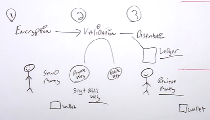

#### Certified Blockchain Solutions Architect | M3 Ethereum Blockchain
#### L06: Ethereum Consensus

# 6.1  Blockchain Transactions

- Joe and Sally must have a wallet 
- Joe purchase Bitcoin and place in wallet 
- Joe initiate transfer of Bitcoin to Sally 
- Joe uses private key and signature and send its encrypted information over to the blockchain network which is a Bitcoin network. 
- Joe's private key will be synced up into blockchain to validate it's him, and that he possess the fund. Thus validating Joe that he possesses the right amount of Bitcoin to send to Sally 
- Assuming she has the right key, Sally will be able to receive the money into her wallet. 

Encryption --> Validation --> Distribution --> Written to Ledger (Immutable). 

# 6.2  Ethereum Architecture Overview

| Ethereum  Architecture |
| --- |
| Dapps |
| Smart Contracts |
| EVM |
| Nodes --> Ledger |
| Network |

- It has to be on a network (Internet). 
- Nodes are going to be deployed, where the ledger will be maintained 
- EVM will help to deploy the Smart Contract and Dapps 
- Smart Contracts are executable codes/computer program. 
- DApps is a collection of smart contracts 

# 6.3  Ethereum Ledger

Ethereum Ledger 
- Consensus is when the distributed ledger has been updated and all nodes maintain their own identical copy of the ledger 
- This architecture allows for a new capacity as a system of recordkeeping that goes beyond being a simple database 
- In Ethereum, the ledger is used for blockchain transactions 
- To access ledger, you need the keys 
- Ethereum uses public key cryptography for authentication 
  - Elliptic Curve Digital Signature Algorithm (ECDSA) secp256k1's curve is used 
- The private key is random 256 bit data sequence. 
