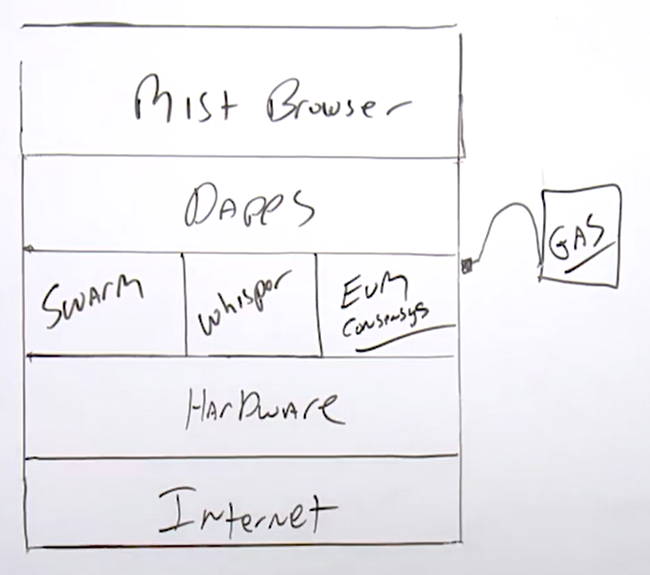

#### Certified Blockchain Solutions Architect | M3 Ethereum Blockchain
#### L08: Ethereum Platform

# 8.1 Ethereum DApps

Dapps (Decentralised Applications) 
- Applications that run on a P2P Network of computers, instead of a single computer 
- One or more smart contracts 
- Generally is open source 
- Data and records of operation of application to be cryptographically stored on ledger 
- Use cryptographic token 
- Generate tokens 
- Decentralised P2P Network 
- Access with Mist Browser 

# 8.2 Ethereum Gas Estimates

Estimate how much it cost to run the DApps with Gas 

Gas Price 
- Amount of Ether that you are willing to spend on every unit of gas 
- Need to determine the price of gas you want to pay for and the maximum amount of gas you want to spend on performing a transaction on the Ethereum network 
- The more important the processing of the transaction, the higher the price should be paid 

Use Metamask for confirming your transaction 
- Balance
- Gas limit 
- Gas Price 
- Can proceed to buy more Ether at Coinbase or Shapeshift 

Gas Price Units 
- Gwei = Unit of Ethereum coin used to calculate transaction Fee 
- One Ethereum coin is worth 1 billion Gwei 
- https://www.myetherwallet.com 

[ETH Gas Station](https://ethgasstation.info)
- Aims to increase the transparency of gas prices, transaction confirmation times, and miner policies on the Ethereum network 

# 8.3 Ethereum Virtual Machine

Ethereum Virtual Machine (EVM) 
- Computer software which runs at an abstraction layer straight above the underlying hardware (hypervisor) 
- Uses a Turing Complete Virtual Machine for running and compiling the codes 
  - Turing Complete states that this software is agile enough to run any code defined by the developer or user 
- EVM has limitation that a typical Turing Complete machine does not, which is that the EVM is intrinsically bound by gas 
- Power of EVM is limited by the amount of gas 
- Stack based VM (last-in-first-out stack) to hold temporary values 
- Implementation can be in Python, ruby, C++ and other languages 
- Fully isolated from network 

> In other words, the developers of Ethereum thought of a really creative way to limit some of the challenges that a token or cryptocurrency could induce. Essentially you can limit that VM by what you want to pay. Now, if you think about it, the price of Ethereum goes up and down every day. So let's say you decide to spend $10 at 6 p.m. and the price of Ethereum goes up 10%. Well, instead of that $10 you're spending, you would spend 11 by the time you execute. 
 
> So let's go ahead and sum this up. Let's make sure we get the terminology. With the EVM, it's going to use what's called gas. Now, gas is essentially going to be provisioned to the miners and that's essentially a way for you to pay an ether to be able to use the Ethereum network. Now, the developers of Ethereum were really creative with gas and basically they understood that the cryptocurrency, the token price could fluctuate, and it's a way for you as a developer to be able to propose a cost and stay within that cost. 

> According to them you can set fix limit. but the price of the gas is not fixed. So if gas is more than your limit, you wont be able to use the network. 

> Gas will change accordingly to the value based on the price of Ethereum so that the amount will always stay the same value of Ethereum at the end regardless of how much Ethereum changes 

# 8.4 Ethereum Networks

The Ethereum network has some terms to know around nodes and type of nodes 
- A node is a device (eventually runs EVM) , program, virtual machine that communicates with the Ethereum network 
- Node are also knowns as clients 
 
Ethereum Node Types 
- When joining the Ethereum network, you have some options of running various types of nodes 
  - Full node verify block that is broadcast onto the network 
    - Think of full node as a node that has the full blockchain 
  - Light node do not verify every block or transaction and do not have a copy of the current blockchain state 
    - A light node has a somewhat up-to-date but not the full blockchain downloaded 
  - Archive node are full nodes that preserve the entire history of transactions 
 
Ethereum Network 
- MainNet is data on the blockchain (which is the production Ethereum network) that includes account balances and transactions, which are public, and anyone can create a node and begin verifying transactions 
- Ether on this network has a market value and can be exchanged for other cryptocurrency or fiat currencies 
 
Three Main types of extended Ethereum Networks 
- Public Test Networks 
- Enterprise/Private Networks 
- Local Test Networks 
 
Public Test Networks (known as Testnets) 
- Public Test Network is used by developers to test Ethereum applications before final deployment to the main network (MainNet) 
- Ether on these networks is used for testing purposes only and has no value 
- E.g., Ropsten, Koven, Rinkeby 
  - [Ropsten](https://ropsten.etherscan.io): A proof-of-work blockchain that most closely resembles Ethereum; you can easily mine faux-Ether.  
  - Kovan: A proof-of-authority blockchain, started by the Parity team.  
  - Rinkeby: A proof-of-authority blockchain, started by the Geth team 
 
Private/Enterprise Test Networks 
- Private Ethereum networks allow parties or part of consortium, to share data without making it publicly accessible 
- Private blockchain is a good choice for sharing of sensitive data and scaling to handle higher read/write throughput 
- E.g., Quorum 
  - Developed by a consortium with [JP Morgan](https://www.jpmorgan.com/country/US/EN/Quorum)
 
[Ethereum Network Status Monitor](https://ethstats.net) 
- Check the health of the Ethereum network
- Must add your node to the network to be seen 
- Does not represent the full state of network 
- Shows Key Performance Indicators 
 
Local Test Network 
- Ethereum blockchain can be simulated locally for deployment 
- Local test networks process transactions instantly and Ether can be distributed as desired 
- Ethereum simulator 
- E.g., [Ganache](http://truffleframework.com/ganache) 

# 8.5 Ethereum Data Storage

Ethereum IPFS ([Inter-Planetary File System](https://ipfs.io))
- Peer-to-peer hypermedia protocol 
- Compare as a single BitTorrent swarm exchanging and sharing data through multiple computers storing the same file 
- IPFS is a versioned file system that can take files and manage them 
- IPFS will also store them somewhere and then tracks versions over time 
- IPFS accounts for how those files move across the blockchain network as in a distributed FS 
 
IPFS is a protocol 
- Defines a content-addressed file system 
- Coordinates content delivery 
- Combines Kademlia + BitTorrent + Git 
 
IPFS is a filesystem 
- With directories and files 
- Mountable filesystem (via FUSE) 
 
IPFS is a web 
- Can be used to view documents like the web 
- Files accessible via HTTP 
- Hash-addressed content guarantees authenticity 
- Browsers or extensions can learn to use the URL Scheme 
 
IPFS uses crypto 
- Cryptographic-hash content addressing 
- Block-level deduplication (remove redundancies in file structure) 
- File integrity + versioning 
- Filesystem-level encryption + signing support 
 
IPFS is P2P 
- Worldwide peer-to-peer file transfers 
- Completely decentralised architecture 
- No central point of failure (CPOF) 
 
IPFS is a CDN (Content-Delivery Network) 
- Add a file to the filesystem locally, and it's now available to the world 
- Caching-friendly 
- Bit-torrent-based bandwidth distribution 
  - Bit-Torrent is a distributed way to have media distributed where it's not centralised 
  - Bandwidth is optimised using a lot of bit-torrent's best practices and features 
 
IPFS has a name service, IPNS; An SFS inspired name system 
- Global namespace based on PKI 
- Serves to build trust chains 
- Compatible with other name service 
- Flexibility in namespace. 
  - E.g., can map DNS, .onion, .bit, etc. to IPNS. 

# 8.6 Gas Estimate (Demo) 

[EtherGasStation](https://ethergasstation.info)

Statistics 
- Standard cost of transfer 
- Gas Price Standard 
- SafeLow Cost for Transfer 
- Gas Price SafeLow 
  - Don't go below the price of it as your transaction may not process in a reasonable amount of time 
- Median Wait (Time) 
- Median Wait (Blocks) 
 
Graphs 
- Transaction Count by Gas Price 
- Confirmation Time by Gas Price 
- Recommended Gas Price 
- Top 10 Miners by Block Mined 

# 8.7 Gas Account Metamask (Demo)

[EthStats](https://ethstats.net)
 
Metamask can be used on the MainNet (main Ether network) or local test network or public test network. 
- Allow you to know your address 
- Estimate gas or pay for using the network 
- Buy tokens from Coinbase (Crypto/FIAT (USA only)) or ShapeShift (Crypto) 
  - Provide the exchange rate information 
  - Need to have your own BTC account to transfer 
 
- Able to view account on Etherscan 
- Able to download logs 
- Could set up URL as well 
- Able to change conversion to other cryptocurrencies or FIAT 

# 8.8 Blockchain Forks and Segwits 

EVM is a Turning Complete virtual machine which meant that it is agile enough to run any code 
 
EVM runs on top of the hardware, which is an abstraction layer.  
- It has the hardware, so it can be any node on any network 
- EVM is broken down into consensus (the blockchain, the algorithm, updating the blockchain), the Whisper (messaging service to interact with other nodes), Swarm (act as storage, which is IPFS storage). 
- EVM is limited by gas, which meant that for developers to use the EVM, they need to have enough gas to power it. 
  - If they want to execute any kind of transactions, they need to make sure that their balance of gas is enough to complete that smart contract or DApps.  
- Mist browser allow us to access the DApps. 
