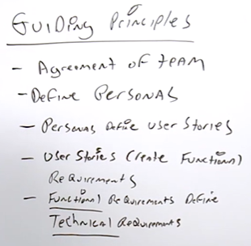

#### Certified Blockchain Solutions Architect | M3 Ethereum Blockchain
#### L09: Ethereum Development Tools

# 9.1  Ethereum Development Overview 

Tools with Ethereum 
- Languages 
  - Solidity, Serpent, Mutan 
- IDE 
  - Solidity Browser, Ethereum Studio 
- Clients 
  - Geth, eth, parity, Ethereum Wallet 
- Storage 
  - IPFS. Swarm and Storj 
- DApps Browser 
  - Metamask or Mist 
- Testing 
  - Testnet, TestRPC 
 
Frontend Tools used with Ethereum 
- HTML 
- CSS 
- JavaScript 
 
Backend Tools used with Ethereum 
- Solidity  
- Serpent 
 
Solidity 
- Language designed specifically for Ethereum, to utilise the EVM 
- Ethereum-based applications and Smart Contracts are written in Solidity 
- Solidity was proposed in August 2014 by Dr Gavin Wood for Ethereum 
- Uses a whole new framework that is similar to JavaScript and C 
 
Solidity vs JavaScript 
- Solidity is kind of an OOP language like C++ and C# whereas JavaScript is based on HTML 
- Solidity is designed specifically for Ethereum applications and it runs only on the Ethereum blockchain 
- JavaScript is a universal language for the web and is used in a large number of applications 
- APIs 
- JSON is a lightweight data-interchange format. It can represent numbers, strings, ordered sequences of values, and collections of name/value pairs. 
- To talk to an Ethereum node from inside a JavaScript application, use the web3.js library which gives an convenient interface for the remote procedure calls methods 

# 9.2 - 9.5  Ethereum Development Tool

[Metamask](https://metamask.io) is a bridge that allows you to visit the distributed web of tomorrow in your browser today 
- Browser for Ethereum 
- It allows you to run Ethereum dApps right in your browser without downloading/running a full Ethereum node 
- Metamask injects a JavaScript library called web3.js 
- MetaMask includes a secure identity vault, providing a user interface to manage your identities on different sites and sign blockchain transaction 
- Metamask could be considered as a zero client (no local storage) 
- Zero Clients run in the browser in JavaScript 
- Metamask is the best ERC20 compatible wallet, it provides extra layer of security from phishing sites 
- Download via browser extension in Chrome 
 
Mist 
- Browser for decentralised web apps (Web 3.0) 
  - IE or Google Chrome are for Web 2.0 
  - Still in heavy development and may not support untrusted dApps 
- It is a full node, and thus will download the full Ethereum blockchain 
- Integrates with Swarm 
- It is a flexible desktop hybrid electron application with a web interface 
- Developed by Ethereum foundation https://github.com/ethereum/mist 
 
Parity 
- Lightweight browser-based wallet that give users access to decentralised applications and currencies on Ethereum 
- Fastest and most efficient way to access the Ethereum blockchain 
- [Parity](https://www.parity.io) is an implementation is written in Rust 
- One of the two most common implementations in the Ethereum network 
- Parity comes with an extensive built-in Ethereum Wallet and dApp environment 
  - Allow you to develop and use the wallet at the same time 
  - It's fully integrated, no need to use a separate wallet and a separate development environment 
- It supports a Web3 dApp browser 
- Supported platform are Linux, Mav OS and Windows 
- Two types of installation: binary or scripted install for users 
  - Docker installation exist as well 
 
Geth (known as Go-Ethereum or GETH) 
- Implementation of Ethereum network written in the Golang/Go programming language 
- A multipurpose command line tool that runs a full Ethereum node implemented in Go 
- Can be downloaded and installed in a variety of ways 
  - Via Mist browser 
  - Package manager 
  - Docker containers 

# 9.6 Download Ethereum (Demo)

The wallet is essentially on the blockchain, and that when you are using the [Ethereum](https://www.ethereum.org) wallet, you are literally connected to the blockchain and that the wallet is located on the blockchain itself.  
 
So locally we are going to download the blockchain and the wallet will be set up. 
 
Things we can do 
- Send cryptocurrencies 
- Deploy new contracts 
- View other contracts on the blockchain 
- Create customise tokens 
- Watch other tokens that are on the Ethereum network 

# 9.7 Metamask (Demo)

[Metamask](https://metamask.io) is a great tool for folks that are using Ethereum 
- Especially Ethereum developers that don't want to download the full Ethereum block chain 
- Available in Chrome Extension or Brave Browser 
  - It is interesting because Chrome Extension is a webJ3 extension while Chrome is a web 2.0 browser. Thus this extension helps to interact with the Ethereum network and dApps as well 
  - Able to test and use other test network 
    - Ropsten, Kovan, Rinkeby 
    - Main Ethereum Network 
  - Able to view Etherscan (Block Explorer) 
  - Able to view QR code 
  - Copy address to clipboard 
  - Export Private Key 
- Metamask is a bridge to the Ethereum network.  
  - A web 3.0 browser 
  - It is a zero client. 

# 9.8 Technical Requirements

Functional requirements 
- General request by the user 
  - E.g., I want to be able to submit an expense or I want to view a report or I want to clear log files.  
- Functional requirements isn't very specific.  
  - Hence, technical requirements are the specific details that act as counterparts to functional requirements.  
- As a developer or solution architect, we have to look at functional requirement and ponder, how do we arrive from functional requirements to technical requirements? What do I need to do to execute this request?  
 
Technical requirements 
- Need to define tasks 
  - E.g., The technical requirement for how to submit expenses is I want to place an icon in the corner of my web screen or I want to place a link where the user can click to bring me to an application that will have me fill out a form.  
 
> So for the CBSA exam, what I want to make sure you understand is that the functional requirements drive the technical requirements and the technical requirements are actually what's going to define the tasks and the tasks then, once you define the tasks, you can get together your estimates of what you need, how much time it'll take to complete, any skill sets you may need, as well.  
 
> Your job as a Certified Blockchain Solutions Architect is to actually be able to define these requirements and then come up with the requirements and estimates, skill sets to successfully define a blockchain architecture. And for the exam, just remember the difference between functional and technical requirements. And that these are driven generally by the personas. 

# 9.9 Guiding Principles

Guiding Principles
- Guiding principles at a high level is about the agreement of your development team and the best practices on how to develop a blockchain solution 
- Agreement of team / Work together as a team 
  - Define what you're going to be working on 
  - How are you going to work on it 
  - What is the end game 
- Define persona 
  - A type of user and its user stories to help create functional requirements 
  - Functional requirements will help to define technical requirements 
 
Guiding principles act as a collection of best practices on how to go from start to finish when it comes to developing the blockchain architecture 
