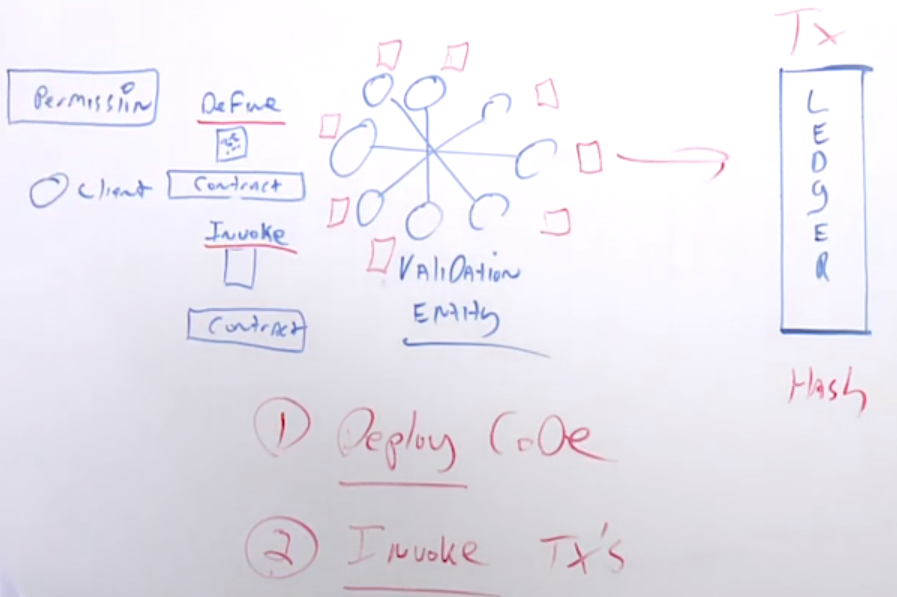

#### Certified Blockchain Solutions Architect | M4 Hyperledger Blockchain
#### L12: Hyperledger Project Structure

# 12.1 Hyperledger Infrastructure

Hyperledger Infrastructure Module 
- Leadership 
- Governing Board 
- Marketing 
- Technical Steering Committee 
 
Goal of the Linux Foundation's management of ecosystems that accelerate 
- Open development 
- Commercial Adoption 
 
Governing Board comprised of one voting representative from each Premier Hyperledger member and attended by the TSC and Marketing Committee Chairs, the Governing Board's responsibilities include 
- Approving a budget 
- Electing a Chair to preside over Governing Board meetings, authorize expenditures approved by the budget and manage any day-to-day operations 
- Oversee all Project business and marketing 

# 12.2 Hyperledger Fabric Model

Hyperledger Fabric is a permissioned enterprise blockchain, very modular with a lot of built-in capabilities with specific distinctions. 
- Two specific functions: Define and Invoke 
  - Users are able to deploy the code 
  - Invoke code by the transactions 
  - Able to deploy and invoke at the same time 
- Validation standpoint 
  - Entities are validators and could be the users as well 
  - Thus in Hyperledger, you can have validators and users
