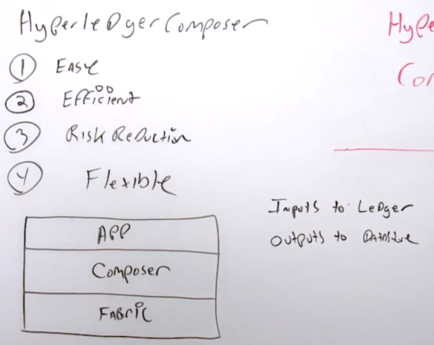

#### Certified Blockchain Solutions Architect | M4 Hyperledger Blockchain
#### L13: Hyperledger Value

# 13.1 Hyperledger Project Value

Hyperledger Project as a goal is a modular approach to how blockchains are developed, delivered, maintained and put into production. 
 
Hyperledger Project brings value to the enterprise in several ways 
- Open Source 
  - Able to take a software solution and provide it to the public domain and have it openly available to the public 
- Collaborative software development approach 
- Transparency to the user base 
- Longevity 
  - Maintain a solution and keep it relative 
- Interoperability 
  - Able to take other solutions and integrate them 
  - Able to take chain code and create side chain and add other values like adding crypto currencies and connections to Ripple and whichever solution it requires 
- Transformative 
  - Changing the way company do businesses 
- Goal is to bring blockchain technologies forward to mainstream commercial adoption fruition 

# 13.2 Hyperledger Composer

Hyperledger Composer is important to Hyperledger Fabric as Hyperledger Composer allows developers to build and deploy application on top of an abstraction layer for Hyperledger Fabric. 
 
Hyperledger Composer main benefits 
- Easy 
  - Not much learning curve if you are already developing in a specific language (e.g., Go or Java) that is well integrated. 
- Efficient 
  - Quick and easy as it is driven by workflows. 
- Risk Reduction 
  - A lot of built-in tools which alleviate a lot of the risks subjected to code 
- Flexible 
  - Able to vary based on how you want to use it 
 
- Hyperledger Fabric is going to be what you're going to deploy to Compose the applications to Fabric.  
- Application layer is going to be on top of Composer. 
- At a high level, Composer sits in the middle between Application and Fabric. 
- For Composer, inputs are sent to the ledger where the ledger is immutable. The outputs will got to a datastore and that's Hyperledger Composer at a high level.
