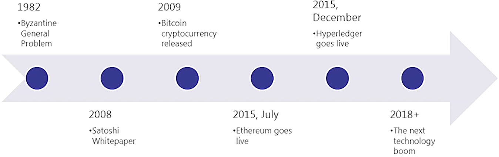

#### Certified Blockchain Solutions Architect | M2 Basics of Blockchain
#### L2: Blockchain and Cryptocurrency 

# 2.1  History of Blockchain

Blockchain History
- It is important to review the people who inhabit Yap Island and their unique currency called Rai Stones
- These stones could not be physically traded so the Yapese people used mental ledgers where all tribe members kept a copy of the ledger in their head
- First known use of a ledger

Byzantine Generals Problem
- The problem: Number of general (from same army) have surrounded a walled city on all sides
- Balance of power is such that if all generals attack at the same time, they will take the city
- The challenge: If general are not coordinated in their attack, they will lose the city and their campaign
- The solution: Use cryptography to encrypt messages
- Provides mathematical computation power
- Ensures privacy
- In 2008, a whitepaper is published by Satoshi Nakamoto which outlines a solution to the Byzantine Generals problem
- Bitcoin was started and thus the cryptocurrency launched in 2009

History
- Bitcoin uses a Proof-of-Work (PoW) consensus algo
- Work must be provided to solve the problem
- Bitcoin was the original solution to the BFT problem

Blockchain Release Date
- 2009: Bitcoin
- 2015: Ethereum
- 2015: Hyperledger

# 2.2  What is a Blockchain

Blockchain Basics
- Cryptographically secure, shared, distributed ledger
- Immutable transactions are written on this distributed ledger on distributed nodes
- Transformational technology in which business and government invest in
- It's a decentralised database which stores information in the form of transactions
- Blockchains are similar to a book that can be written to but not erased
   - Book = Blockchain
   - Page = Block
   - Page Entry = Blockchain Transaction
- Blockchains can be private or public
- Blockchains are a revolutionary way of implementing trust into a platform
- Blockchain is a globally shared data structure, transactional backend database (In Bitcoin, it's generally called a ledger)
   - Everyone can read entries in the database just by participating in the network
   - To change something in the database, you have to create a so-called transaction which has to be accepted by all other
   - Transaction implies that the change you want to make (assume you want to change two values at the same time) is either not done at all or completely applied
- Compare blockchain to other technology
   - Telcom network to a telephone
   - Databases are centralised where the blockchain is decentralised
   - Blockchains are not built from a new technology. They are built from a unique syncing of three existing technologies
		
Blockchain Technologies
- P2P networks
- Private Key Encryption
- Programs

Blockchain Digital Identity
- Digital Identity is established
   - Combining a public and private key creates a strong digital identity reference based on possession
	
Blockchain Revolution
- Blockchain is revolutionary in several ways
   - Blockchain is not a new technology but a synching of technologies that now make sense
   - Trust is at the center and essentially removes intermediaries (efficiency)
   - Tamperproof public ledger of value
   - Disruptive to the status quo. Legacy is out
   - Platform with numerous use cases

Blockchain Review
- Blockchain is a complex technology but is a simple concept really. Trust is at the center
   - Blockchains are ledgers shared among computers around the world
   - The ledgers in a blockchain are immutable

# 2.3  Blockchain Ledgers

Blockchain Ledgers
-  Consensus is when the distributed ledger has been updated and all nodes maintain their own identical copy of the ledger
-  This architecture allows for a new capacity as a system of recordkeeping that goes beyond being a simple database
-  A ledger is an append-only record store, where records are immutable and may hold more general information than financial records
-  A distributed ledger is a database that stored and updated independently by each node in the blockchain
  - Decentralised and distributed nature is what makes it unique
  - In blockchain, they are immutable
  - Every single node on the network processes every transaction that occurs

# 2.4  Blockchain Components

Blockchain Key Components
-  Cryptography
-  P2P Network
-  Shared Digital Ledger
-  Consensus Algorithm
-  Validity Rules
-  Virtual Machines

Cryptography
-  Cryptography for transactions
-  Recorded, encrypted and secured between peers in blockchain
-  No need for a centralised authority
	
P2P Network
-  P2P Network connects the blockchain nodes
-  All computers share responsibility on the network
-  Workloads are shared

Shared Digital Ledger
-  Shared Digital Ledger is a data structure managed inside the node application
-  Distributed Database held and updated independently by each participant (or node) in a large network

The Consensus Algorithm
-  The Consensus algorithm is implemented as part of the node application for how the ecosystem comes to a single view of the ledger
-  Different ecosystems have different methods for attaining consensus
-  Determines method for world state (view of the blockchain and its status)

Validity Rules
-  Validity Rules (validation) state how the user and the transactions will be validated

Virtual Machine
-  Virtual Machines are a representation of a server created by a computer program and operated with instructions embodied in a language
-  Ethereum and Bitcoin uses VMS
-  E.g., The virtual machine lives in the Ethereum node applications

 # 2.5 Blockchain Permission (Private) or Permissionless (Public)

 Blockchain Architectures
- Originally developed as permissionless (E.g., BTC)
- Public Blockchain, Open Blockchain, Permissionless
- Private Blockchain, Closed Blockchain, Permissioned, Enterprise Blockchain
- Ethereum is Permissionless, Hyperledger is Permissioned
- Enterprise prefer Private for security and performance

Considerations on private vs public blockchain
- Governance (Generally preferred private blockchain)
- Industry Vertical (Financial logistics -> Private BC, Social Media -> Public BC such as Ethereum)
- Smart Contract Functionality (Private BC such as Hyperledger has flexibility with smart contract unlike ripple. Public BC such as Ethereum is more suitable.
- Cryptocurrency Requirement
- Consensus Algorithm
- Costing Model (Private more expensive as supporting own nodes)
- Integration (BC to an enterprise application, Application Support, Developer integration)
- Transaction Performance
- Trust
- Transparency
- Privacy
- Security

