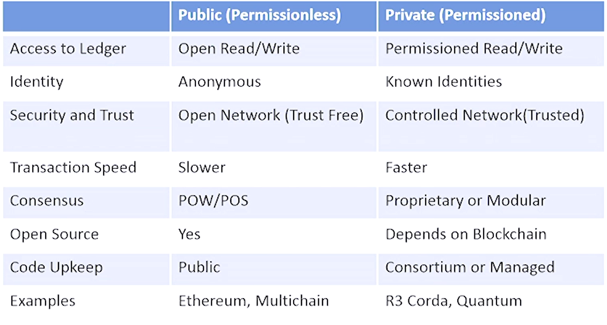

Own Notes

# 2.02

## Blockchain Key Component
- Cryptography
- P2P Network
- Shared Digital Ledger
- Consensus Algorithm
- Validity Rules
- Virtual Machines

## Type of blockchain architecture
- open/permissionless and private/permissioned blockchain

| | Ethereum | Hyperledger |
| --- | --- | --- |
| Industry | Cross-Industry | Cross-Industry |
| Ledger | Permissionless | Permissioned |
| Consensus | POW | Pluggable Architecture |
| Smart Contracts | Yes | Yes |
| Coin/Token | Yes | No |

## Trust vs Trustless

Trust Blockchain 
- Establishing Trust In Blockchain 
  - Essentially transferring trust from an intermediary to technology  
  - Storing data in blockchain through cryptography functions 
  - All transaction data on the BC is assumed to be trustworthy 
  - Data has not been tampered with 
  - Blockchain is immutable (can't be deleted or modified) 

Trustless Blockchain 
- What is trustless in Blockchain 
  - Trustless as it is a model that does not require trust to safely interact and transact a deed or purchase 
  - Trustless blockchain is a transfer of trust to technology from organizations (Banks, Government, Corporations) 
  - Built on premise that "transparent code" essentially removes the need for intermediaries (technology) 
  - Smart contracts essentially reduce the need for accountants, lawyers, bankers etc as trust is formed. 
  - Financial transparency can result through the use of blockchains and thus reduce the need for intermediaries 
  - Ledger act as a trust broker when two parties don't trust each other 

## Soft Fork vs Hard Fork
Soft Fork vs Hard Fork
| Soft Fork | Hard Fork |
| --- | --- |
| Tightening the rules (E.g., 1MB -> 0.5MB) | Expanding the rules (E.g., 1MB -> 2MB) |
| Backwards compatible | Not backwards compatible |
| Old nodes accept new blocks | Old nodes don't accept new blocks |

## Segwit (Segregated Witness) 
- Separate transaction signatures 
- Removes signatures. 
- Create efficiency of transactions by removing signatures to free up capacity to add more transactions to the chain 
- Increases security threats by removing digital signatures 
- Improves scalability issue (UTX0) 
- Reduces transaction times by skipping calculation for signatures 
- Enables off-chain protocols (P2SH256) 
- Improve transaction security by reducing malleability (ability to be shaped) (transaction malleability) 
 

# Bitcoin Improvement Protocol
- BIP is a design document for introducing features or information to Bitcoin 

Three Major Types of BIPs 
- Standard tracks 
- Informational 
- Process

## Cryptocurrency Wallet

Software Wallet 
- Programs that you download and run on personal computer 

Web Wallet 
- Hosted on website of a company which provides bitcoin wallet services 
- Wallets are easier to set up and use, but have to rely on hosting company to provide sufficient security measures, which can sometimes be a dangerous trade off  
- Coinbase is an online exchange that is hosted in US 

Hardware Wallet 
- Maintains high levels of security to protect your coins by storing your coins offline 
- Offline storage keeps your coins out of reach from hackers because they are not on the Internet 
- Cost is more expensive than a software or web wallet 
 
Paper Wallet 
- Offline wallet and is considered the safest type 
- Just a printout 
 
Wallet Security 
- Restrict unsupervised accessed. Strong passwords and close all ports and maintain a strict firewall 
- Frequently change address. Use a different address for every transaction 
- Multiple Signatures. Multiple private keys to deter breaches. 
 
Ethereum Wallets 
- E.g., Metamask, Myetherwallet, Jaxx (multi-cryptocurrency wallet)

# 2.03

Example of BC Algos: 
- Proof of Work 
- Proof of Stake 
- Delegated Proof-of-Stake (DPoS) 
- Byzantine Fault Tolerance (BFT) 
- Directed Acyclic Graphs (DAGs)
- 
